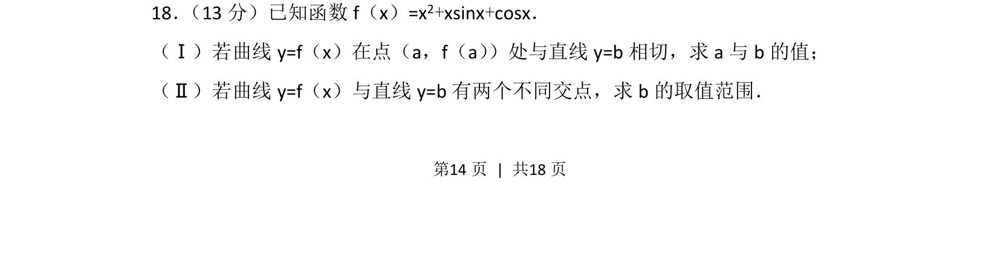
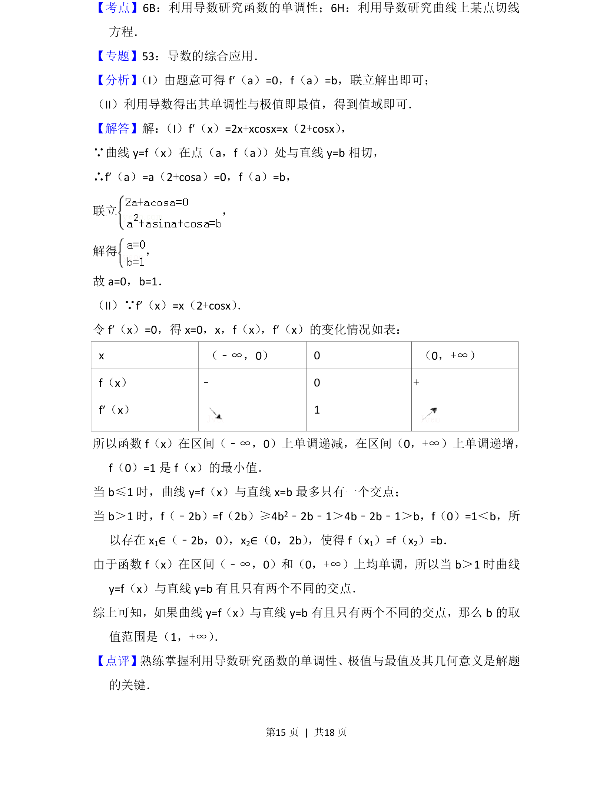

## 题面

## 摘要

考查利用导数研究曲线的切线及两曲线交点问题，涉及参数求解与取值范围。

## 关联考点

- [[840-导数几何意义|导数几何意义]]
- [[288-函数零点|函数零点]]
- [[721-参数取值范围|参数取值范围]]
- [[422-切线方程|切线方程]]

## 答案与解析

> 📄 原 PDF 第 14 页：`素材/真题/北京/2008-2024·（北京）数学高考真题/2013年高考数学试卷（文）（北京）（解析卷）.pdf`
