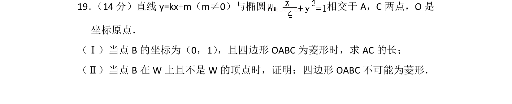
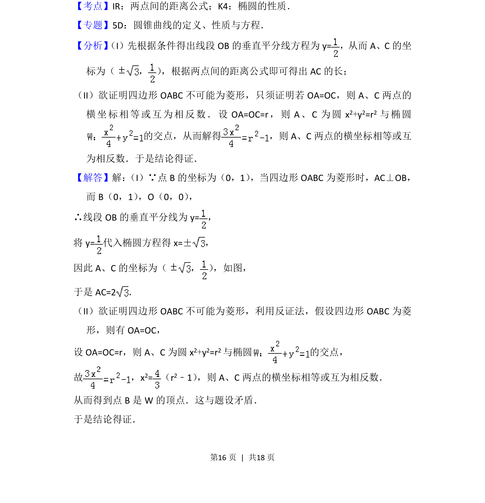
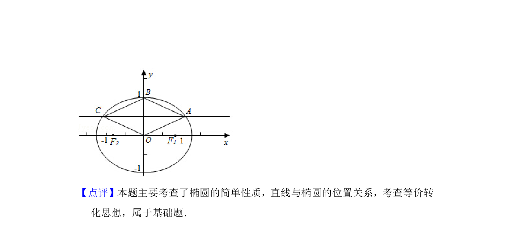

## 题面

## 摘要

椭圆与直线相交，结合菱形性质求弦长及反证法证明不可能为菱形

## 关联考点

- [[1365-两点间的距离公式|两点间的距离公式]]
- [[945-椭圆的性质|椭圆的性质]]
- [[1180-反证法|反证法]]

## 答案与解析

> 📄 原 PDF 第 16 页：`素材/真题/北京/2008-2024·（北京）数学高考真题/2013年高考数学试卷（文）（北京）（解析卷）.pdf`
