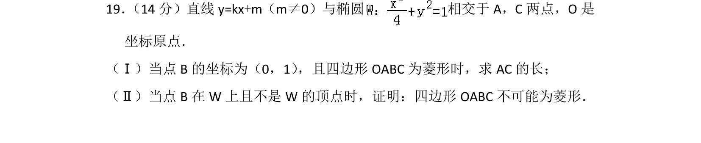
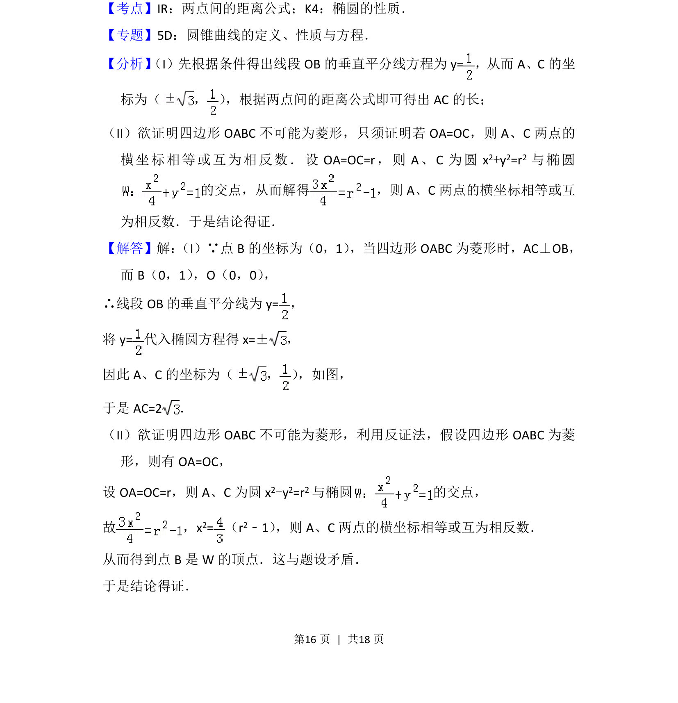
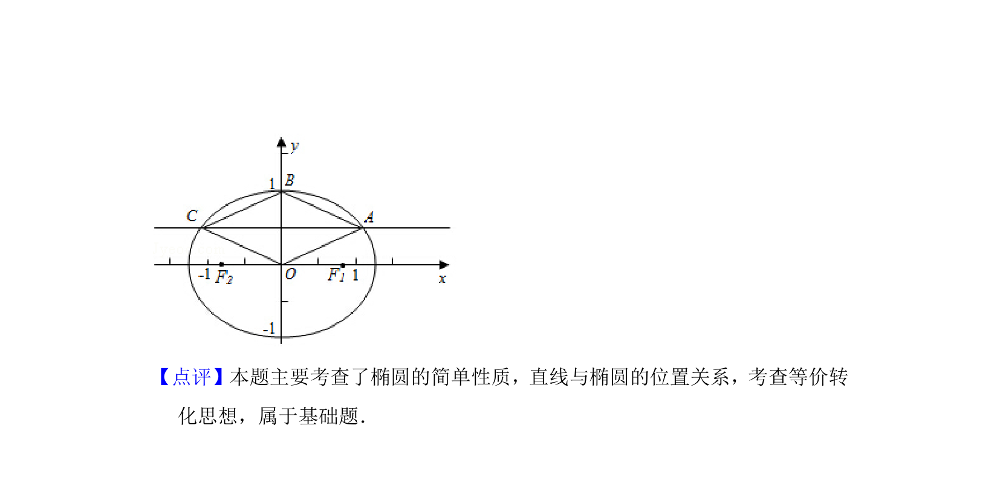

## 题面

## 摘要

椭圆与直线相交，结合菱形性质求弦长及反证法证明不可能为菱形

## 关联考点

- [[626-两点间距离公式|两点间的距离公式]]
- [[944-椭圆的性质|椭圆的性质]]
- [[1179-反证法|反证法]]

## 答案与解析

> 📄 原 PDF 第 16 页：`素材/真题/北京/2008-2024·（北京）数学高考真题/2013年高考数学试卷（文）（北京）（解析卷）.pdf`

<!-- 题干文本-start -->
## 题干文本
19． （14分）直线y=kx+m（m≠0）与椭圆 相交于A，C两点，O是
坐标原点．
（Ⅰ）当点B的坐标为（0，1） ，且四边形OABC为菱形时，求AC的长；
（Ⅱ）当点B在W上且不是W的顶点时，证明：四边形OABC不可能为菱形．
<!-- 题干文本-end -->

<!-- 解析文本-start -->
## 解析文本
【考点】IR：两点间的距离公式；K4：椭圆的性质．菁优网版权所有
【专题】5D：圆锥曲线的定义、性质与方程．
【分析】 （I）先根据条件得出线段OB的垂直平分线方程为y=，从而A、C的坐
标为（ ， ） ，根据两点间的距离公式即可得出AC的长；
（II）欲证明四边形OABC不可能为菱形，只须证明若OA=OC，则A、C两点的
横坐标相等或互为相反数．设OA=OC=r，则A、C为圆x 2+y2=r2 与椭圆
的交点，从而解得 ，则A、C两点的横坐标相等或互
为相反数．于是结论得证．
【解答】解： （I）∵点B的坐标为（0，1） ，当四边形OABC为菱形时，AC⊥OB，
而B（0，1） ，O（0，0） ，
∴线段OB的垂直平分线为y=，
将y=代入椭圆方程得x=±，
因此A、C的坐标为（ ， ） ，如图，
于是AC=2．
（II）欲证明四边形OABC不可能为菱形，利用反证法，假设四边形OABC为菱
形，则有OA=OC，
设OA=OC=r，则A、C为圆x 2+y2=r2与椭圆 的交点，
故 ，x 2=（r 2﹣1） ，则A、C两点的横坐标相等或互为相反数．
从而得到点B是W的顶点．这与题设矛盾．
于是结论得证．
<!-- 解析文本-end -->
