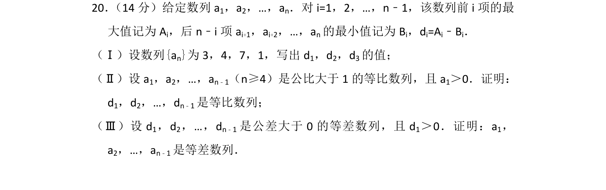
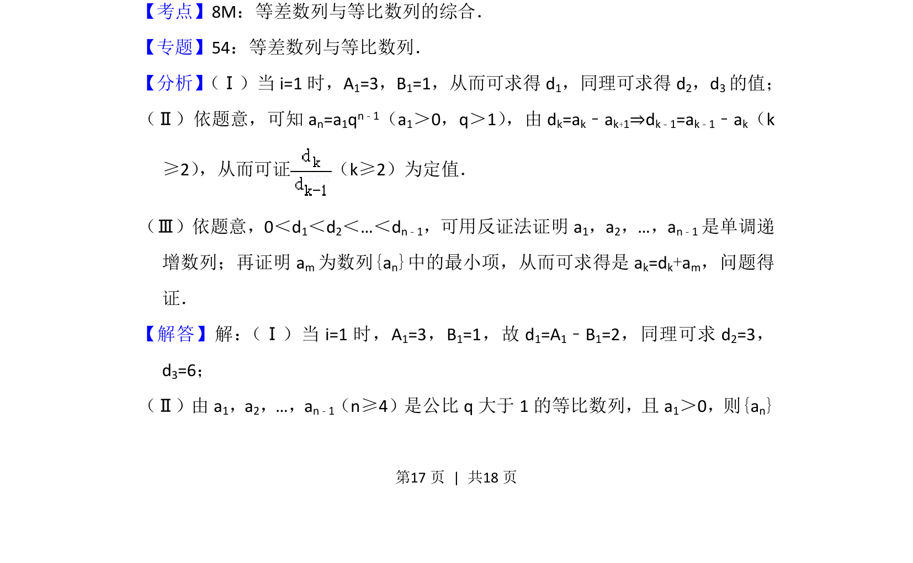
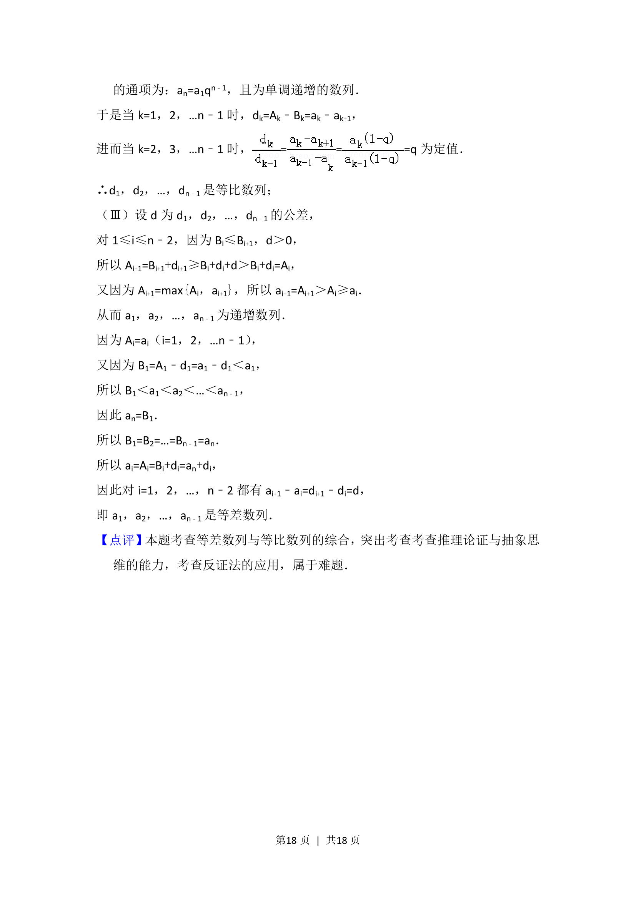

## 题面

## 摘要

本题通过定义数列的前缀最大值、后缀最小值之差，考查等差数列与等比数列的判定与证明。

## 关联考点

- [[356-等差数列概念|等差数列]]
- [[1067-等比数列的定义与通项公式|等比数列]]
- [[综合证明]]
- [[1179-反证法|反证法]]

## 答案与解析

> 📄 原 PDF 第 17 页：`素材/真题/北京/2008-2024·（北京）数学高考真题/2013年高考数学试卷（文）（北京）（解析卷）.pdf`
