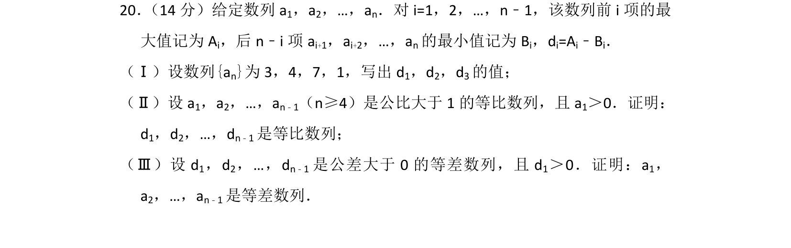
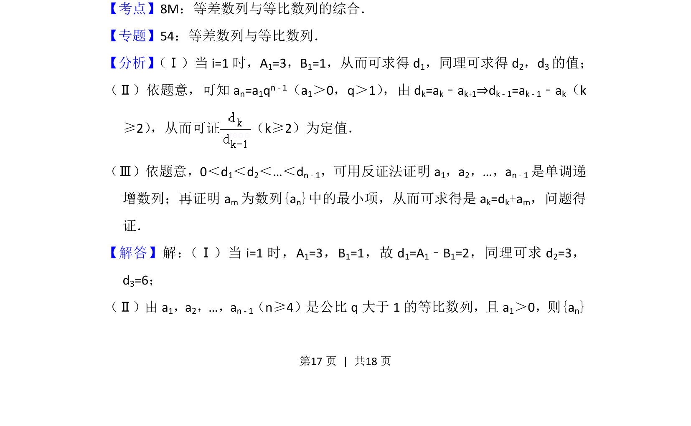
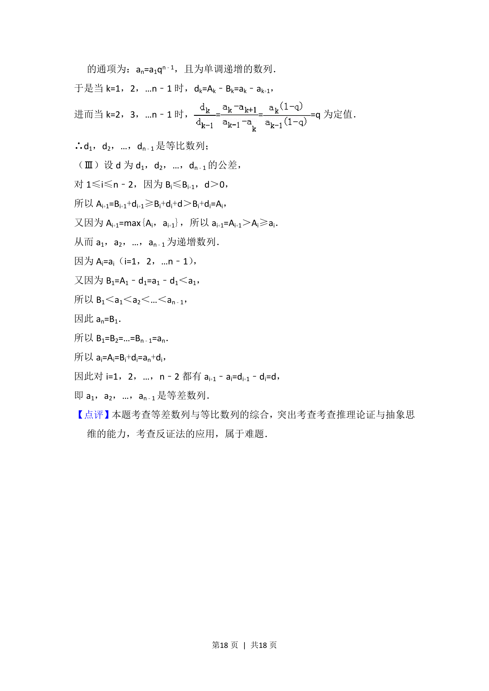

## 题面

## 摘要

本题通过定义数列的前缀最大值、后缀最小值之差，考查等差数列与等比数列的判定与证明。

## 关联考点

- [[356-等差数列概念|等差数列]]
- [[1067-等比数列的定义与通项公式|等比数列]]
- [[综合证明]]
- [[1179-反证法|反证法]]

## 答案与解析

> 📄 原 PDF 第 17 页：`素材/真题/北京/2008-2024·（北京）数学高考真题/2013年高考数学试卷（文）（北京）（解析卷）.pdf`

<!-- 题干文本-start -->
## 题干文本
20． （14分）给定数列a1，a2，…，an．对i=1，2，…，n﹣1，该数列前i项的最
大值记为A i，后n﹣i项a i+1，ai+2，…，an的最小值记为B i，di=Ai﹣Bi．
（Ⅰ）设数列{an}为3，4，7，1，写出d 1，d2，d3的值；
（Ⅱ）设a 1，a2，…，an﹣1（n≥4）是公比大于1的等比数列，且a 1＞0．证明：
d1，d2，…，dn﹣1是等比数列；
（Ⅲ）设d 1，d2，…，d n﹣1是公差大于0的等差数列，且d 1＞0．证明：a 1，
a2，…，an﹣1是等差数列．
<!-- 题干文本-end -->

<!-- 解析文本-start -->
## 解析文本
【考点】8M：等差数列与等比数列的综合．菁优网版权所有
【专题】54：等差数列与等比数列．
【分析】 （Ⅰ）当i=1时，A1=3，B1=1，从而可求得d 1，同理可求得d 2，d3的值；
（Ⅱ）依题意，可知a n=a1qn﹣1（a1＞0，q＞1） ，由dk=ak﹣ak+1⇒dk﹣1=ak﹣1﹣ak（k
≥2） ，从而可证 （k≥2）为定值．
（Ⅲ）依题意，0＜d1＜d2＜…＜dn﹣1，可用反证法证明a 1，a2，…，an﹣1是单调递
增数列；再证明a m为数列{an}中的最小项，从而可求得是a k=dk+am，问题得
证．
【解答】解： （Ⅰ）当i=1时，A1=3，B 1=1，故d 1=A1﹣B1=2，同理可求d 2=3，
d3=6；
（Ⅱ）由a 1，a2，…，an﹣1（n≥4）是公比q大于1的等比数列，且a 1＞0，则{an}
<!-- 解析文本-end -->
