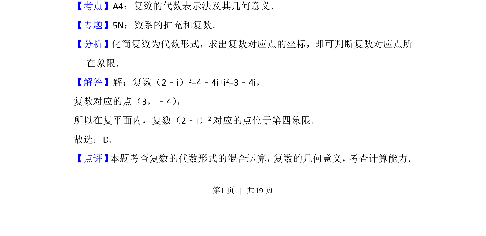

## 题面

## 摘要

复数代数运算及对应点所在象限判断

## 关联考点

- [[1170-复数代数运算|复数的代数运算]]
- [[333-复数的几何意义|复数的几何意义]]
- [[333-复数的几何意义|复平面]]

## 答案与解析

> 📄 原 PDF 第 1 页：`素材/真题/北京/2008-2024·（北京）数学高考真题/2013年高考数学试卷（理）（北京）（解析卷）.pdf`

<!-- 题干文本-start -->
## 题干文本
2． （5分）在复平面内，复数（2﹣i）2对应的点位于（　　）
A．第一象限B．第二象限C．第三象限D．第四象限
<!-- 题干文本-end -->

<!-- 解析文本-start -->
## 解析文本
【考点】A4：复数的代数表示法及其几何意义．菁优网版权所有
【专题】5N：数系的扩充和复数．
【分析】化简复数为代数形式，求出复数对应点的坐标，即可判断复数对应点所
在象限．
【解答】解：复数（2﹣i）2=4﹣4i+i2=3﹣4i，
复数对应的点（3，﹣4） ，
所以在复平面内，复数（2﹣i）2对应的点位于第四象限．
故选：D．
【点评】 本题考查复数的代数形式的混合运算， 复数的几何意义， 考查计算能力．
<!-- 解析文本-end -->
