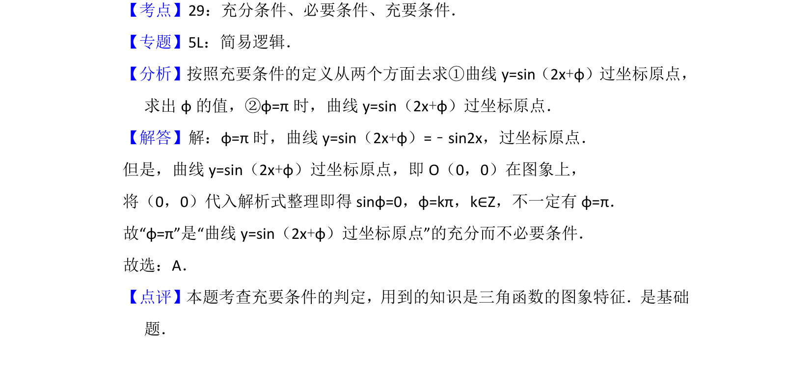

## 题面

## 摘要

曲线 y=sin(2x+φ) 过原点的充要条件判定，涉及三角函数性质和逻辑关系

## 关联考点

- [[278-充分条件必要条件|充分条件]]
- [[278-充分条件必要条件|必要条件]]
- [[279-充要条件|充要条件]]
- [[三角函数图像]]

## 答案与解析

> 📄 原 PDF 第 2 页：`素材/真题/北京/2008-2024·（北京）数学高考真题/2013年高考数学试卷（理）（北京）（解析卷）.pdf`
