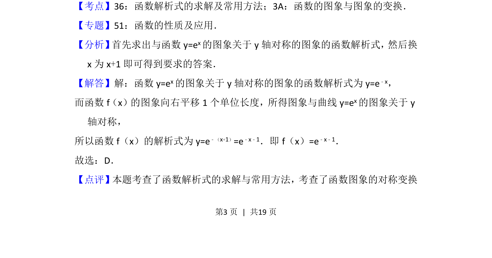
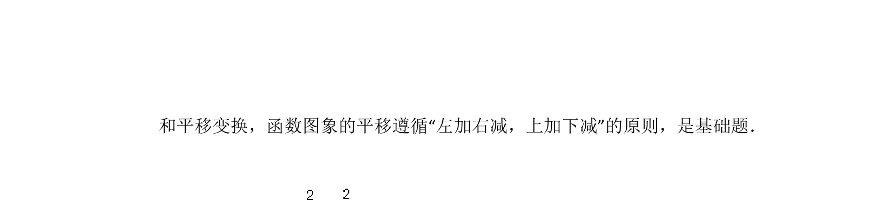

## 题面

## 摘要

考查函数图象的平移与对称变换，求原函数解析式。

## 关联考点

- [[函数解析式的求解]]
- [[函数图象的平移变换]]
- [[函数图象的对称变换]]

## 答案与解析

> 📄 原 PDF 第 3 页：`素材/真题/北京/2008-2024·（北京）数学高考真题/2013年高考数学试卷（理）（北京）（解析卷）.pdf`

<!-- 题干文本-start -->
## 题干文本
5． （5分）函数f（x）的图象向右平移1个单位长度，所得图象与曲线y=ex关于
y轴对称，则f（x）=（　　）
A．ex+1 B．ex﹣1 C．e﹣x+1 D．e﹣x﹣1
<!-- 题干文本-end -->

<!-- 解析文本-start -->
## 解析文本
【考点】36：函数解析式的求解及常用方法；3A：函数的图象与图象的变换．菁优网版权所有
【专题】51：函数的性质及应用．
【分析】 首先求出与函数y=ex的图象关于y轴对称的图象的函数解析式， 然后换
x为x+1即可得到要求的答案．
【解答】解：函数y=e x的图象关于y轴对称的图象的函数解析式为y=e ﹣x，
而函数f（x）的图象向右平移1个单位长度，所得图象与曲线y=e x的图象关于y
轴对称，
所以函数f（x）的解析式为y=e ﹣（x+1）=e﹣x﹣1．即f（x）=e ﹣x﹣1．
故选：D．
【点评】本题考查了函数解析式的求解与常用方法，考查了函数图象的对称变换
<!-- 解析文本-end -->
