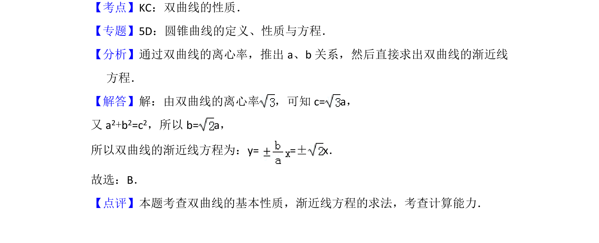

## 题面

## 摘要

通过双曲线的离心率求出a、b关系，进而求其渐近线方程。

## 关联考点

- [[731-双曲线的性质|双曲线的性质]]
- [[391-椭圆离心率|离心率]]
- [[975-渐近线方程|渐近线方程]]

## 答案与解析

> 📄 原 PDF 第 4 页：`素材/真题/北京/2008-2024·（北京）数学高考真题/2013年高考数学试卷（理）（北京）（解析卷）.pdf`
