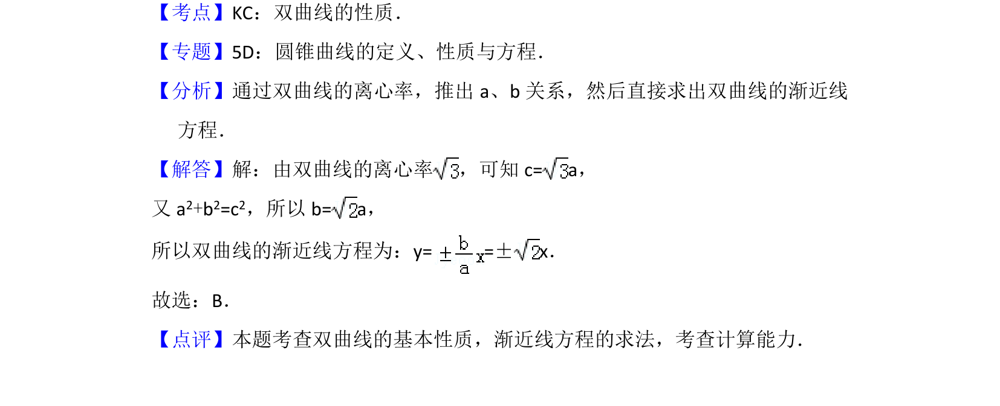

## 题面

## 摘要

通过双曲线的离心率求出a、b关系，进而求其渐近线方程。

## 关联考点

- [[731-双曲线的性质|双曲线的性质]]
- [[391-椭圆离心率|离心率]]
- [[975-渐近线方程|渐近线方程]]

## 答案与解析

> 📄 原 PDF 第 4 页：`素材/真题/北京/2008-2024·（北京）数学高考真题/2013年高考数学试卷（理）（北京）（解析卷）.pdf`

<!-- 题干文本-start -->
## 题干文本
6． （5分）若双曲线 的离心率为 ，则其渐近线方程为（　　）
A．y=±2x B．C．D．
<!-- 题干文本-end -->

<!-- 解析文本-start -->
## 解析文本
【考点】KC：双曲线的性质．菁优网版权所有
【专题】5D：圆锥曲线的定义、性质与方程．
【分析】通过双曲线的离心率，推出a、b关系，然后直接求出双曲线的渐近线
方程．
【解答】解：由双曲线的离心率 ，可知c= a，
又a 2+b2=c2，所以b= a，
所以双曲线的渐近线方程为：y= =±x．
故选：B．
【点评】本题考查双曲线的基本性质，渐近线方程的求法，考查计算能力．
<!-- 解析文本-end -->
