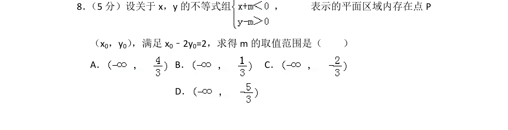
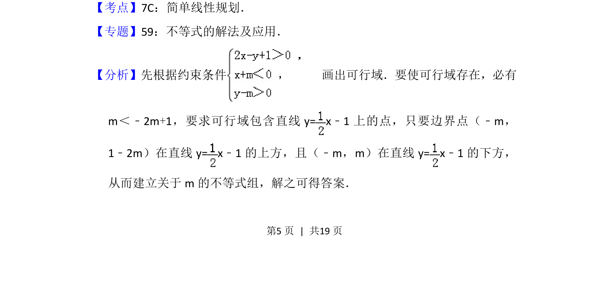
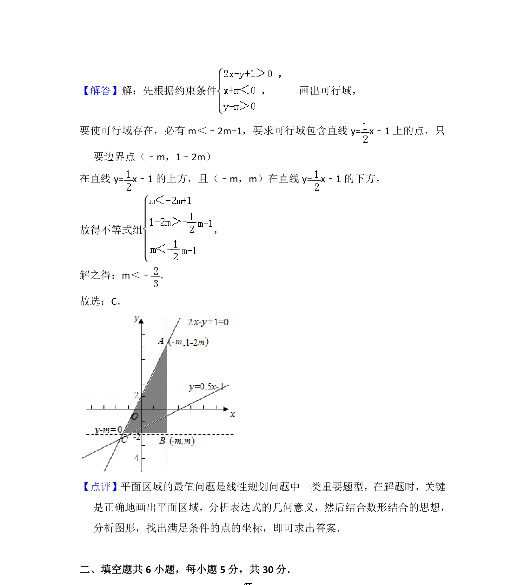

## 题面

## 摘要

考查线性规划中可行域的存在性及直线与平面区域的关系，根据约束条件建立不等式组求解参数取值范围。

## 关联考点

- [[1074-简单线性规划|简单线性规划]]
- [[1156-可行域|可行域]]
- [[115-一元一次不等式组|不等式组]]
- [[726-参数范围|参数范围]]

## 答案与解析

> 📄 原 PDF 第 5 页：`素材/真题/北京/2008-2024·（北京）数学高考真题/2013年高考数学试卷（理）（北京）（解析卷）.pdf`
