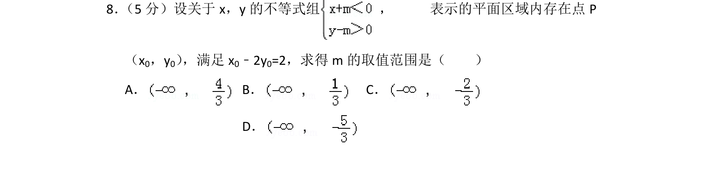
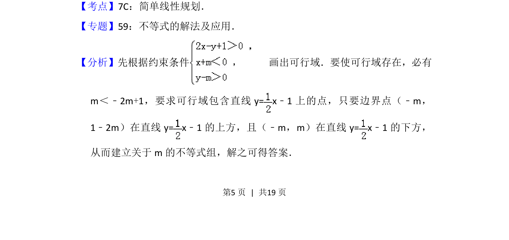
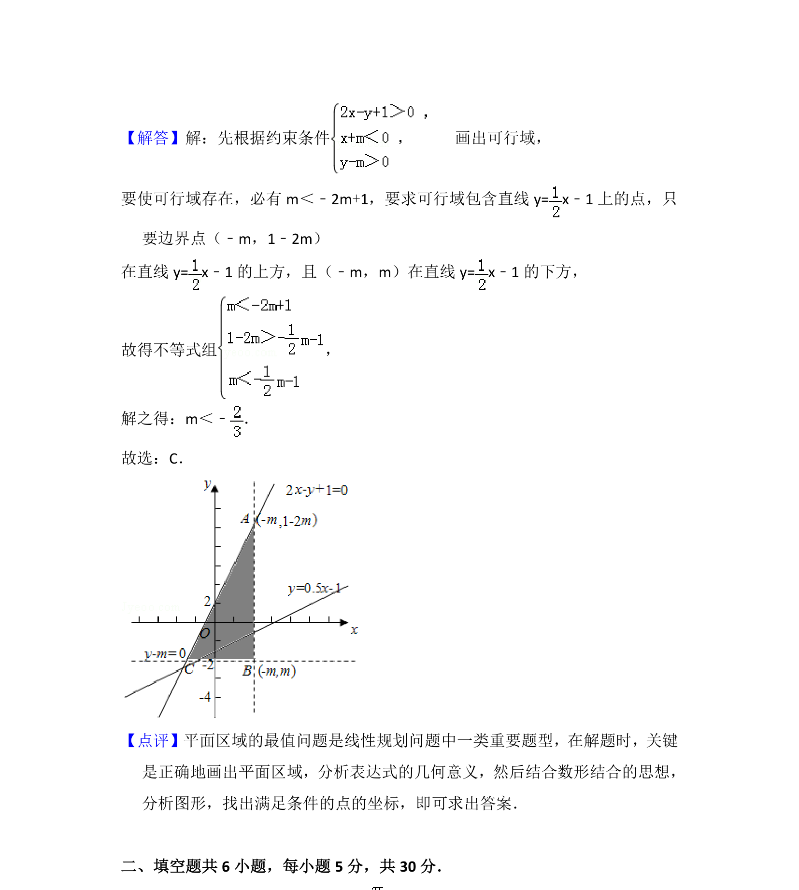

## 题面

## 摘要

考查线性规划中可行域的存在性及直线与平面区域的关系，根据约束条件建立不等式组求解参数取值范围。

## 关联考点

- [[1074-简单线性规划|简单线性规划]]
- [[1156-可行域|可行域]]
- [[115-一元一次不等式组|不等式组]]
- [[726-参数范围|参数范围]]

## 答案与解析

> 📄 原 PDF 第 5 页：`素材/真题/北京/2008-2024·（北京）数学高考真题/2013年高考数学试卷（理）（北京）（解析卷）.pdf`

<!-- 题干文本-start -->
## 题干文本
8． （5分）设关于x，y的不等式组 表示的平面区域内存在点P
（x0，y0） ，满足x0﹣2y0=2，求得m的取值范围是（　　）
A．B．C．
D．
<!-- 题干文本-end -->

<!-- 解析文本-start -->
## 解析文本
【考点】7C：简单线性规划．菁优网版权所有
【专题】59：不等式的解法及应用．
【分析】先根据约束条件 画出可行域．要使可行域存在，必有
m＜﹣2m+1，要求可行域包含直线y= x﹣1上的点，只要边界点（﹣m，
1﹣2m）在直线y= x﹣1的上方，且（﹣m，m）在直线y= x﹣1的下方，
从而建立关于m的不等式组，解之可得答案．
<!-- 解析文本-end -->
