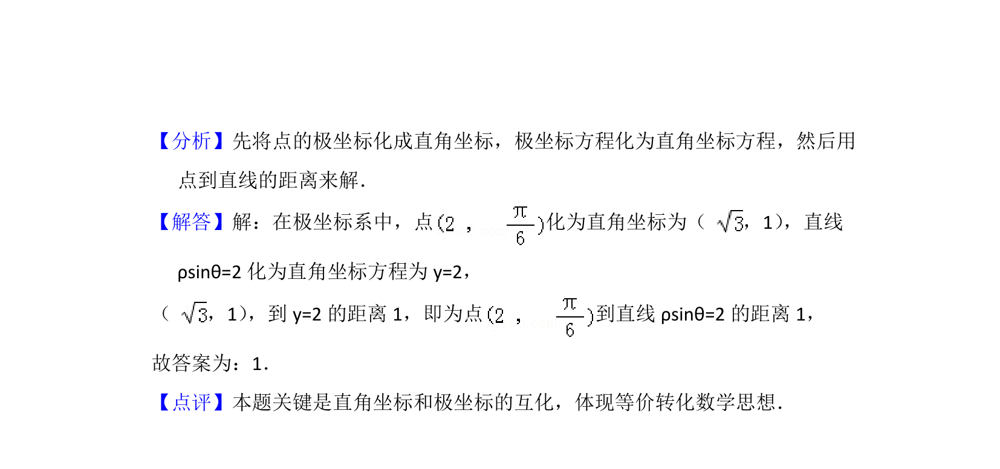

## 题面

## 摘要

极坐标下将点的极坐标化为直角坐标，直线极坐标方程化为直角坐标方程，再用点到直线距离公式求解。

## 关联考点

- [[921-极坐标与直角坐标互化|极坐标与直角坐标互化]]
- [[570-点到直线的距离公式|点到直线的距离公式]]

## 答案与解析

> 📄 原 PDF 第 6 页：`素材/真题/北京/2008-2024·（北京）数学高考真题/2013年高考数学试卷（理）（北京）（解析卷）.pdf`
