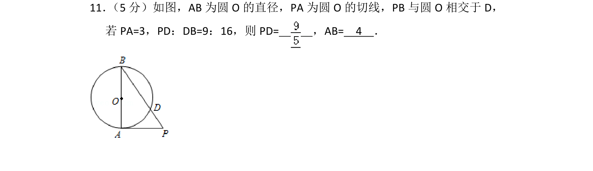
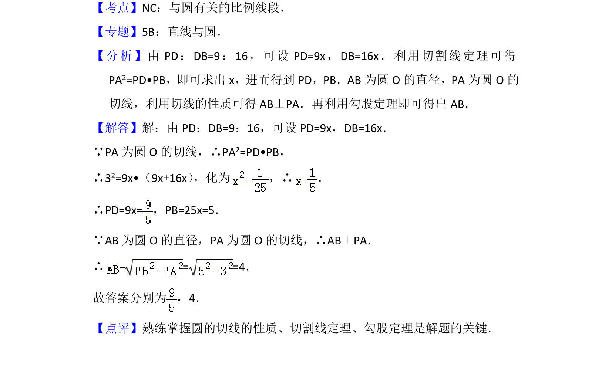

## 题面

## 摘要

该题考查圆中切线、割线关系，利用切割线定理和勾股定理求解线段长度。

## 关联考点

- [[700-切割线定理|切割线定理]]
- [[778-圆的切线性质|圆的切线性质]]
- [[189-勾股定理|勾股定理]]

## 答案与解析

> 📄 原 PDF 第 8 页：`素材/真题/北京/2008-2024·（北京）数学高考真题/2013年高考数学试卷（理）（北京）（解析卷）.pdf`
