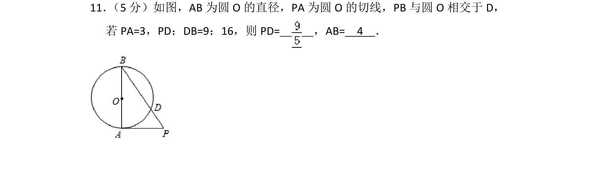
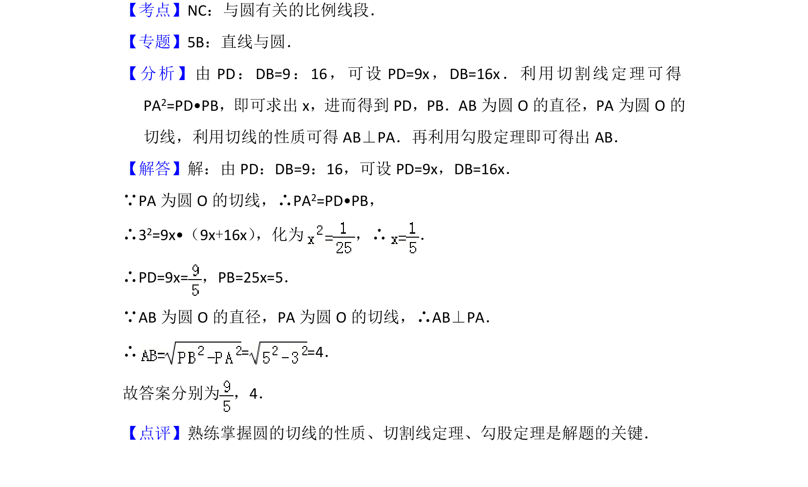

## 题面

## 摘要

该题考查圆中切线、割线关系，利用切割线定理和勾股定理求解线段长度。

## 关联考点

- [[700-切割线定理|切割线定理]]
- [[778-圆的切线性质|圆的切线性质]]
- [[189-勾股定理|勾股定理]]

## 答案与解析

> 📄 原 PDF 第 8 页：`素材/真题/北京/2008-2024·（北京）数学高考真题/2013年高考数学试卷（理）（北京）（解析卷）.pdf`

<!-- 题干文本-start -->
## 题干文本
11． （5分）如图，AB为圆O的直径，PA为圆O的切线，PB与圆O相交于D，
若PA=3，PD：DB=9：16，则PD=　 　，AB=　4　．
<!-- 题干文本-end -->

<!-- 解析文本-start -->
## 解析文本
【考点】NC：与圆有关的比例线段．菁优网版权所有
【专题】5B：直线与圆．
【分析】由PD：DB=9：16，可设PD=9x，DB=16x．利用切割线定理可得
PA2=PD•PB，即可求出x，进而得到PD，PB．AB为圆O的直径，PA为圆O的
切线，利用切线的性质可得AB⊥PA．再利用勾股定理即可得出AB．
【解答】解：由PD：DB=9：16，可设PD=9x，DB=16x．
∵PA为圆O的切线，∴PA 2=PD•PB，
∴32=9x•（9x+16x） ，化为 ，∴ ．
∴PD=9x=，PB=25x=5．
∵AB为圆O的直径，PA为圆O的切线，∴AB⊥PA．
∴= =4．
故答案分别为 ，4．
【点评】熟练掌握圆的切线的性质、切割线定理、勾股定理是解题的关键．
<!-- 解析文本-end -->
