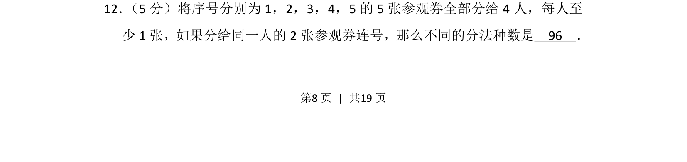
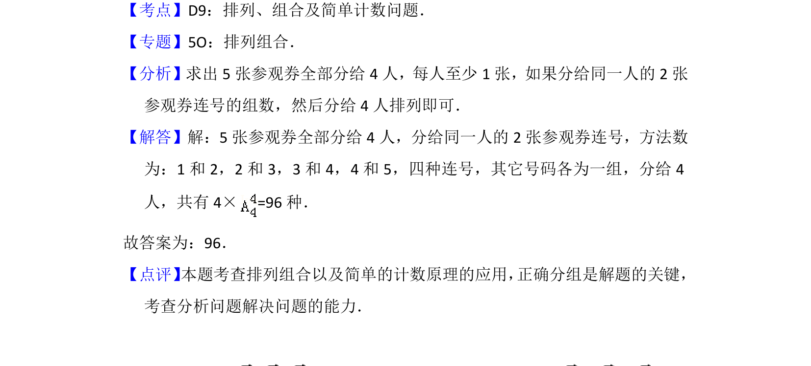

## 题面

## 摘要

将5张连号参观券全部分给4人且每人至少1张，同一人所得2张必须连号。

## 关联考点

- [[031-搭配|排列组合]]
- [[699-分组分配|分组分配]]
- [[484-排列应用-相邻问题|捆绑法]]
- [[连号限制]]

## 答案与解析

> 📄 原 PDF 第 8 页：`素材/真题/北京/2008-2024·（北京）数学高考真题/2013年高考数学试卷（理）（北京）（解析卷）.pdf`
