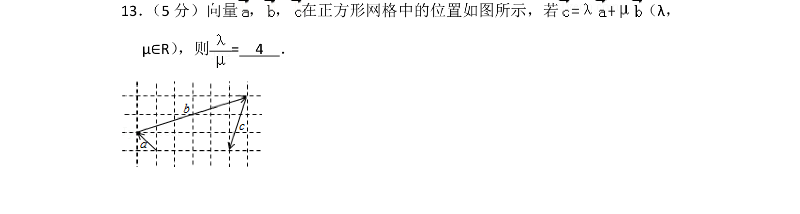
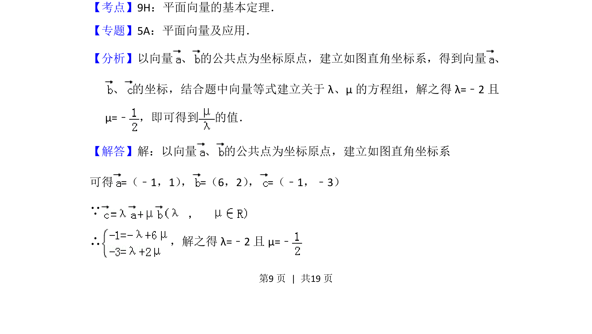
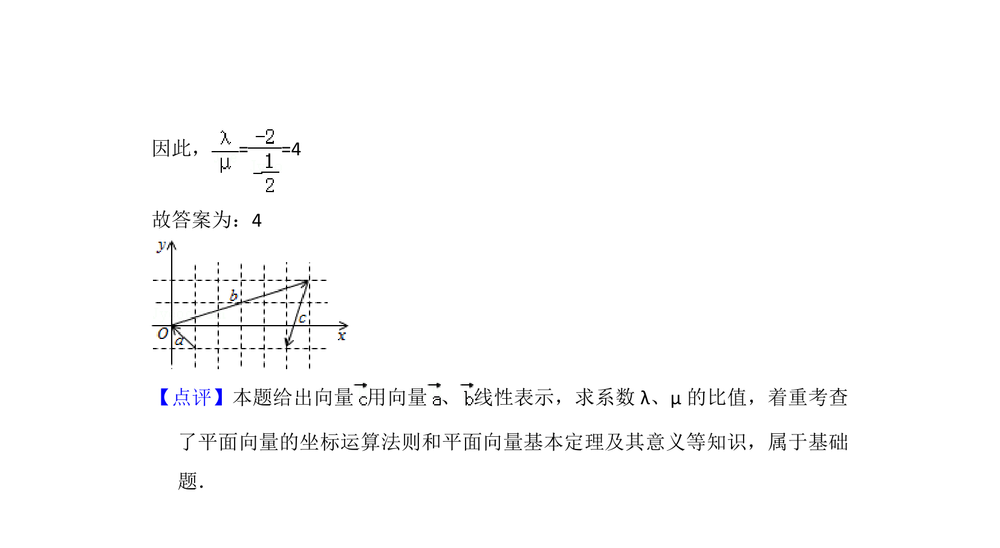

## 题面

## 摘要

向量在网格中的坐标表示与基本定理的应用，通过建立坐标系求解参数比值。

## 关联考点

- [[336-平面向量基本定理|平面向量的基本定理]]
- [[541-向量坐标运算|向量的坐标运算]]

## 答案与解析

> 📄 原 PDF 第 9 页：`素材/真题/北京/2008-2024·（北京）数学高考真题/2013年高考数学试卷（理）（北京）（解析卷）.pdf`

<!-- 题干文本-start -->
## 题干文本
13． （5分）向量 ， ， 在正方形网格中的位置如图所示，若 （λ，
μ∈R） ，则=　4　．
<!-- 题干文本-end -->

<!-- 解析文本-start -->
## 解析文本
【考点】9H：平面向量的基本定理．菁优网版权所有
【专题】5A：平面向量及应用．
【分析】以向量 、 的公共点为坐标原点，建立如图直角坐标系，得到向量 、
、 的坐标，结合题中向量等式建立关于λ、μ的方程组，解之得λ=﹣2且
μ=﹣，即可得到 的值．
【解答】解：以向量 、 的公共点为坐标原点，建立如图直角坐标系
可得=（﹣1，1） ，=（6，2） ，=（﹣1，﹣3）
∵
∴ ，解之得λ=﹣2且μ=﹣
<!-- 解析文本-end -->
