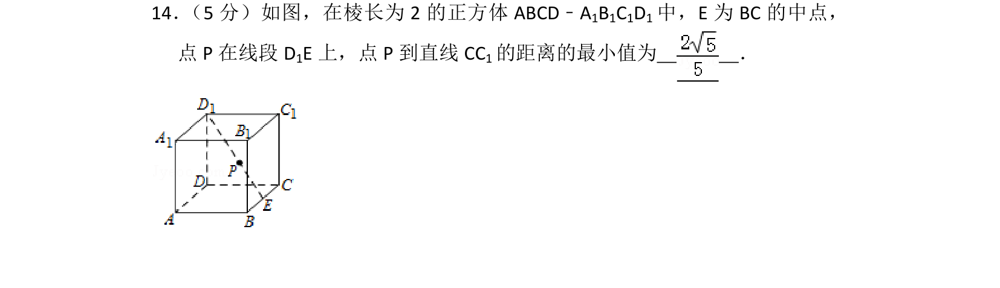
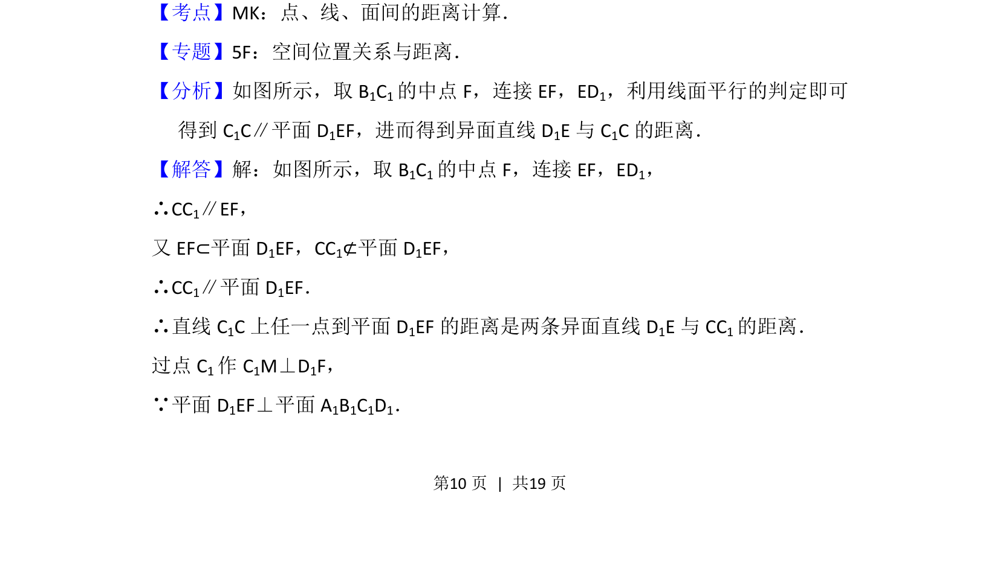
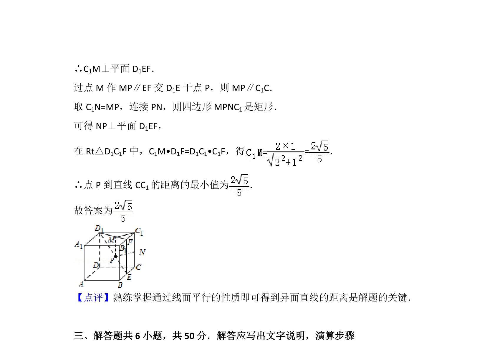

## 题面

## 摘要

此题考查在正方体中求点到直线的距离最小值，通过转化为异面直线距离或点面距离求解。

## 关联考点

- [[点线面距离计算]]
- [[352-空间直线平面平行|线面平行]]
- [[354-空间距离|异面直线距离]]
- [[1044-空间几何|空间几何]]

## 答案与解析

> 📄 原 PDF 第 10 页：`素材/真题/北京/2008-2024·（北京）数学高考真题/2013年高考数学试卷（理）（北京）（解析卷）.pdf`
