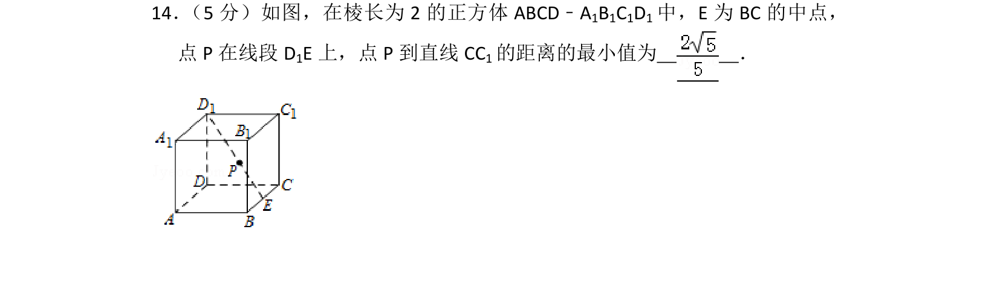
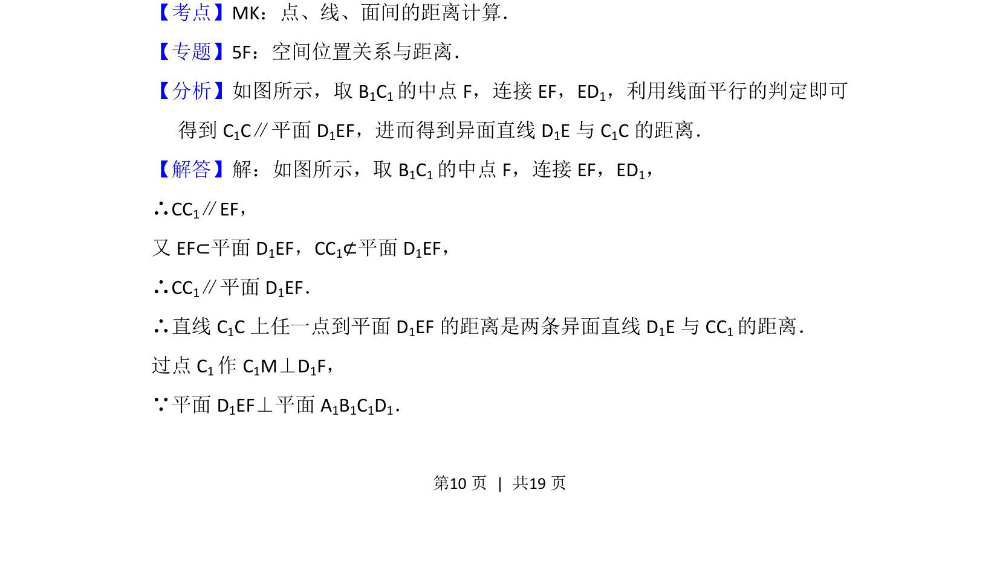
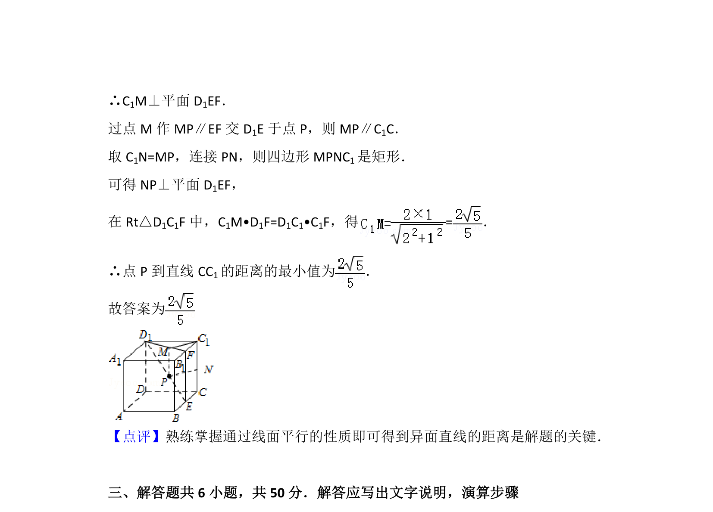

## 题面

## 摘要

此题考查在正方体中求点到直线的距离最小值，通过转化为异面直线距离或点面距离求解。

## 关联考点

- [[点线面距离计算]]
- [[352-空间直线平面平行|线面平行]]
- [[354-空间距离|异面直线距离]]
- [[1044-空间几何|空间几何]]

## 答案与解析

> 📄 原 PDF 第 10 页：`素材/真题/北京/2008-2024·（北京）数学高考真题/2013年高考数学试卷（理）（北京）（解析卷）.pdf`

<!-- 题干文本-start -->
## 题干文本
14． （5分）如图，在棱长为2的正方体ABCD﹣A 1B1C1D1中，E为BC的中点，
点P在线段D 1E上，点P到直线CC 1的距离的最小值为　 　．
<!-- 题干文本-end -->

<!-- 解析文本-start -->
## 解析文本
【考点】MK：点、线、面间的距离计算．菁优网版权所有
【专题】5F：空间位置关系与距离．
【分析】如图所示，取B 1C1的中点F，连接EF，ED 1，利用线面平行的判定即可
得到C 1C∥平面D 1EF，进而得到异面直线D 1E与C 1C的距离．
【解答】解：如图所示，取B 1C1的中点F，连接EF，ED 1，
∴CC1∥EF，
又EF⊂平面D 1EF，CC1⊄平面D 1EF，
∴CC1∥平面D 1EF．
∴直线C 1C上任一点到平面D 1EF的距离是两条异面直线D 1E与CC 1的距离．
过点C 1作C 1M⊥D1F，
∵平面D 1EF⊥平面A 1B1C1D1．
<!-- 解析文本-end -->
