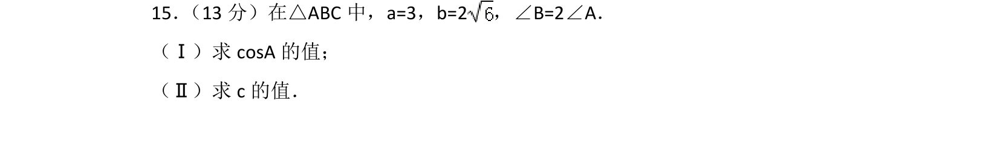
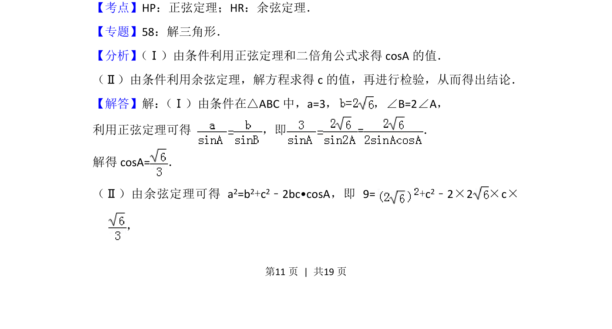
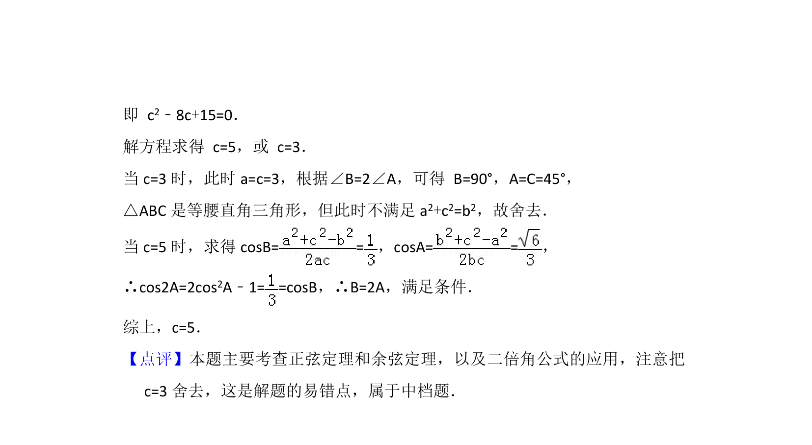

## 题面

## 摘要

解三角形中已知两边和倍角关系求角的余弦值及第三边

## 关联考点

- [[126-定理|正弦定理]]
- [[126-定理|余弦定理]]
- [[637-二倍角公式|二倍角公式]]

## 答案与解析

> 📄 原 PDF 第 11 页：`素材/真题/北京/2008-2024·（北京）数学高考真题/2013年高考数学试卷（理）（北京）（解析卷）.pdf`

<!-- 题干文本-start -->
## 题干文本
15． （13分）在△ABC中，a=3，b=2，∠B=2∠A．
（Ⅰ）求cosA的值；
（Ⅱ）求c的值．
<!-- 题干文本-end -->

<!-- 解析文本-start -->
## 解析文本
【考点】HP：正弦定理；HR：余弦定理．菁优网版权所有
【专题】58：解三角形．
【分析】 （Ⅰ）由条件利用正弦定理和二倍角公式求得cosA的值．
（Ⅱ）由条件利用余弦定理，解方程求得c的值，再进行检验，从而得出结论．
【解答】解： （Ⅰ）由条件在△ABC中，a=3， ，∠B=2∠A，
利用正弦定理可得 ，即=．
解得cosA=．
（Ⅱ）由余弦定理可得 a 2=b2+c2﹣2bc•cosA，即 9=+c 2﹣2×2×c×
，
<!-- 解析文本-end -->
