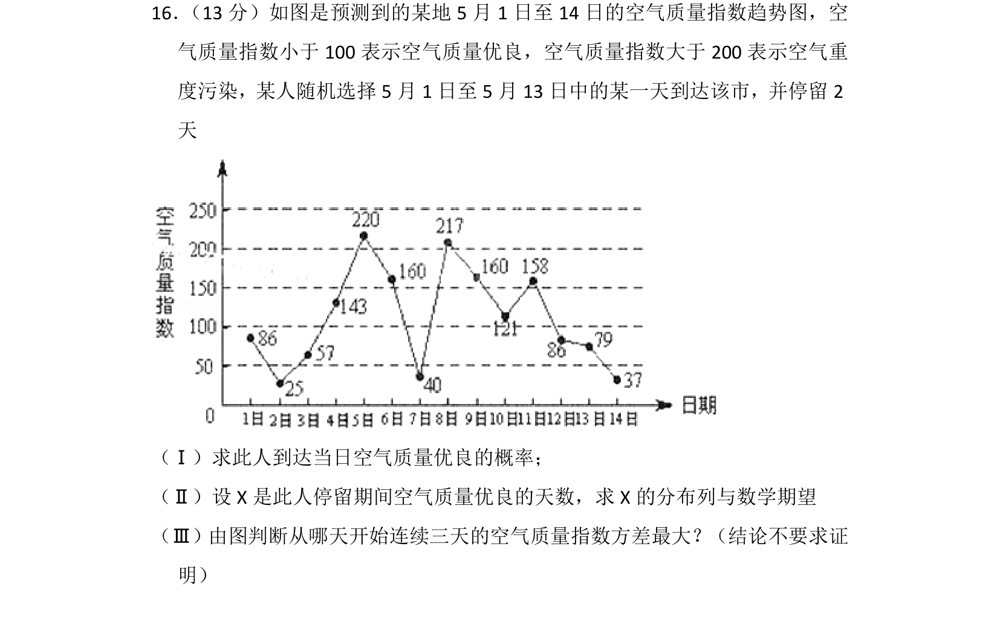
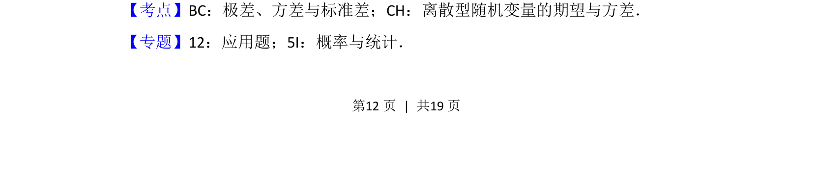
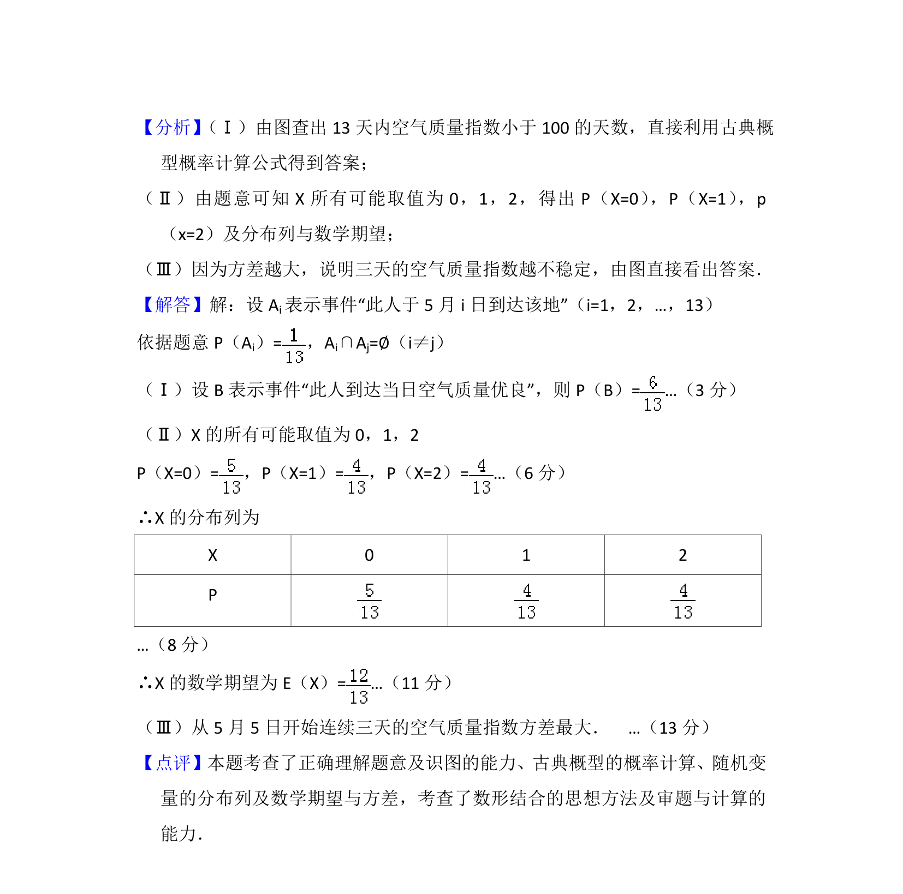

## 题面

## 摘要

该题以空气质量指数趋势图为背景，考查古典概型、随机变量分布列与期望，以及方差比较。

## 关联考点

- [[320-古典概型|古典概型]]
- [[1331-离散型随机变量及其分布列|分布列]]
- [[1040-离散型随机变量的期望|数学期望]]
- [[198-方差|方差]]

## 答案与解析

> 📄 原 PDF 第 12 页：`素材/真题/北京/2008-2024·（北京）数学高考真题/2013年高考数学试卷（理）（北京）（解析卷）.pdf`
