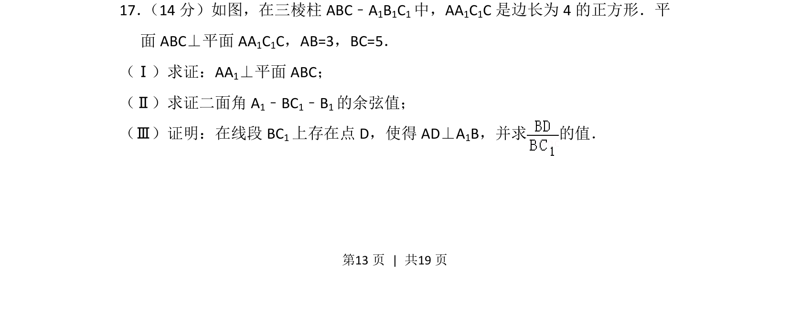
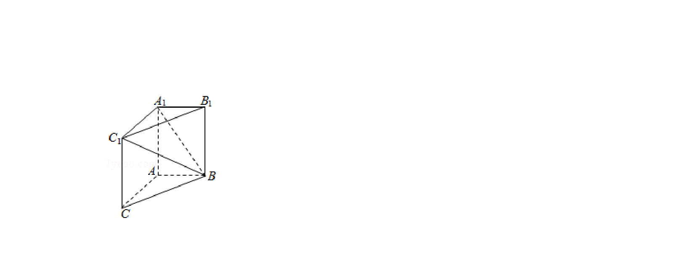
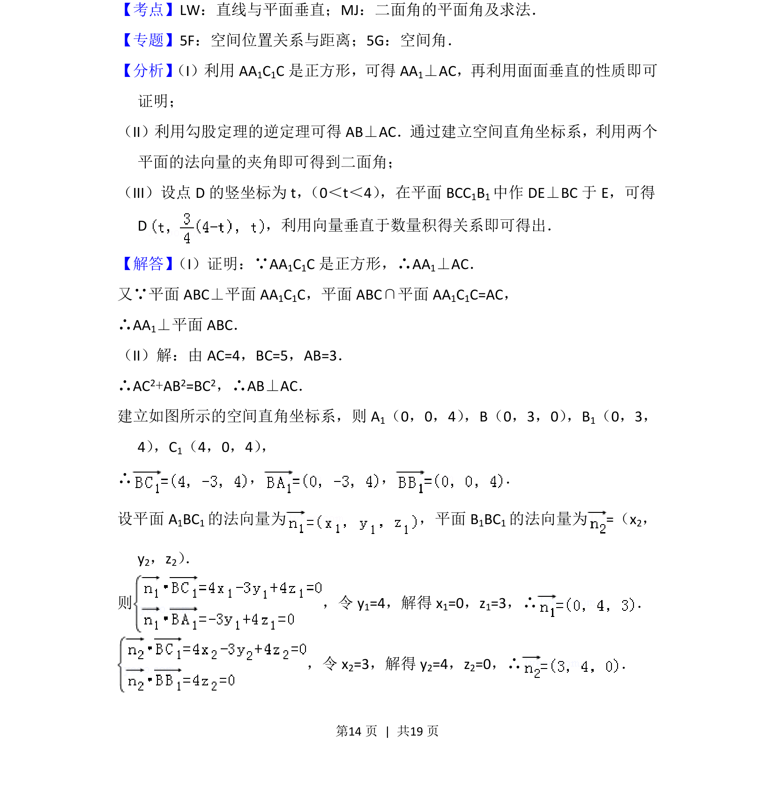
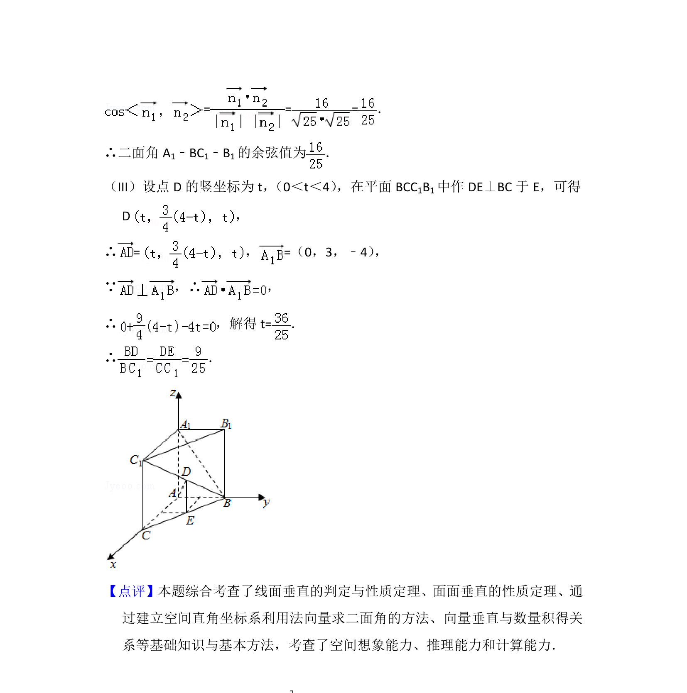

## 题面

## 摘要

本题为三棱柱综合几何题，考查线面垂直证明、二面角余弦值计算及动点存在性问题。

## 关联考点

- [[1355-线面垂直判定|线面垂直判定]]
- [[353-空间角|二面角]]
- [[401-空间向量基本概念|空间向量]]
- [[动点存在性]]

## 答案与解析

> 📄 原 PDF 第 13 页：`素材/真题/北京/2008-2024·（北京）数学高考真题/2013年高考数学试卷（理）（北京）（解析卷）.pdf`
