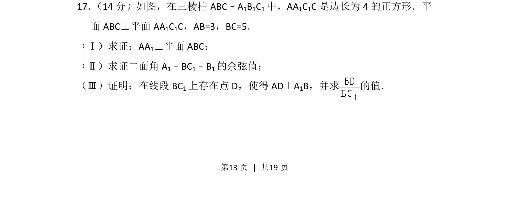
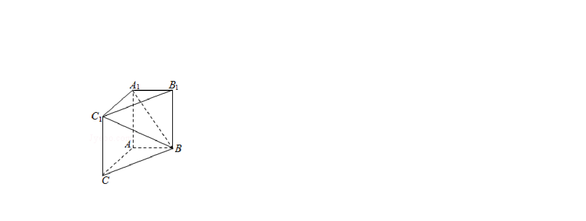
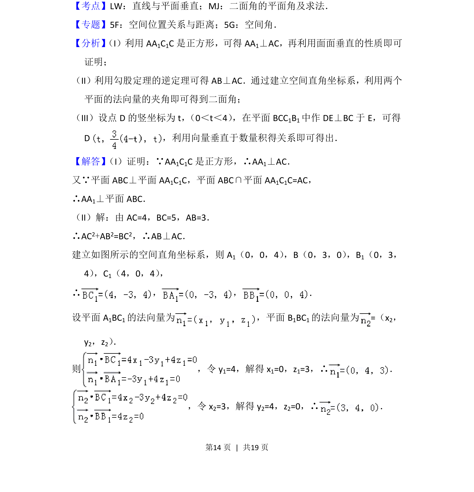
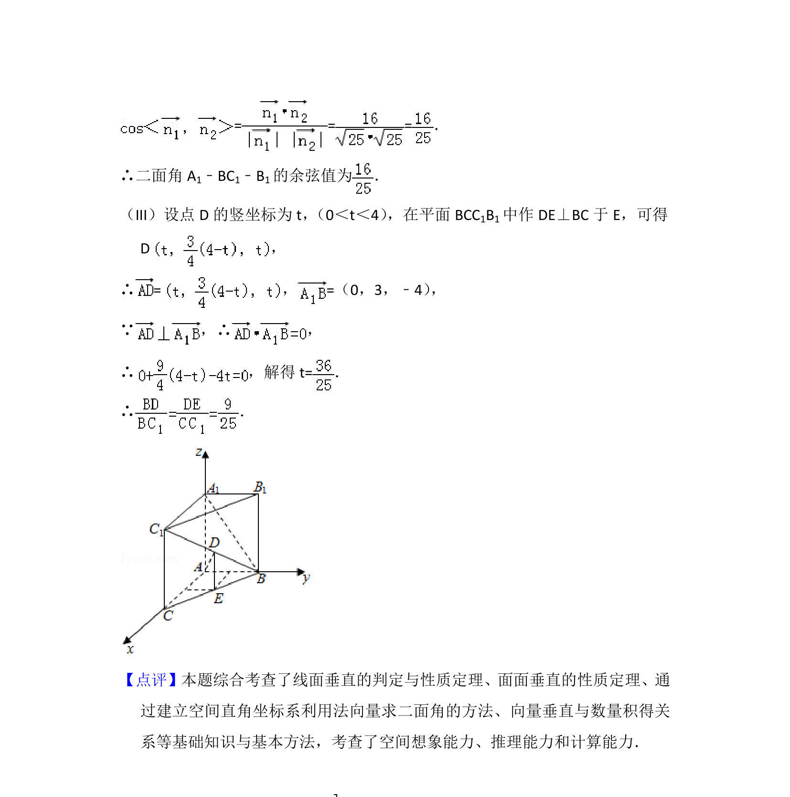

## 题面

## 摘要

本题为三棱柱综合几何题，考查线面垂直证明、二面角余弦值计算及动点存在性问题。

## 关联考点

- [[1085-线面垂直的判定|线面垂直判定]]
- [[353-空间角|二面角]]
- [[401-空间向量基本概念|空间向量]]
- [[动点存在性]]

## 答案与解析

> 📄 原 PDF 第 13 页：`素材/真题/北京/2008-2024·（北京）数学高考真题/2013年高考数学试卷（理）（北京）（解析卷）.pdf`

<!-- 题干文本-start -->
## 题干文本
17． （14分）如图，在三棱柱ABC﹣A1B1C1中，AA1C1C是边长为4的正方形．平
面ABC⊥平面AA 1C1C，AB=3，BC=5．
（Ⅰ）求证：AA1⊥平面ABC；
（Ⅱ）求证二面角A 1﹣BC1﹣B1的余弦值；
（Ⅲ）证明：在线段BC 1上存在点D，使得AD⊥A 1B，并求 的值．
<!-- 题干文本-end -->

<!-- 解析文本-start -->
## 解析文本

<!-- 解析文本-end -->
