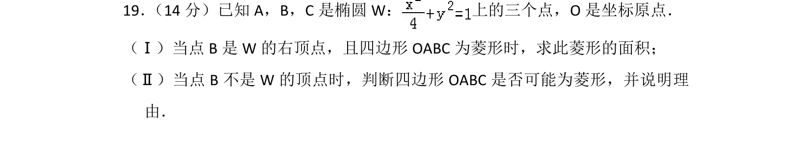
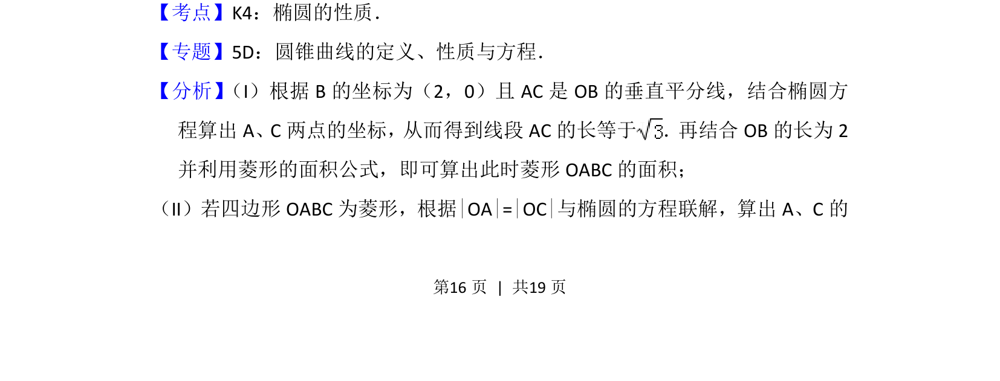
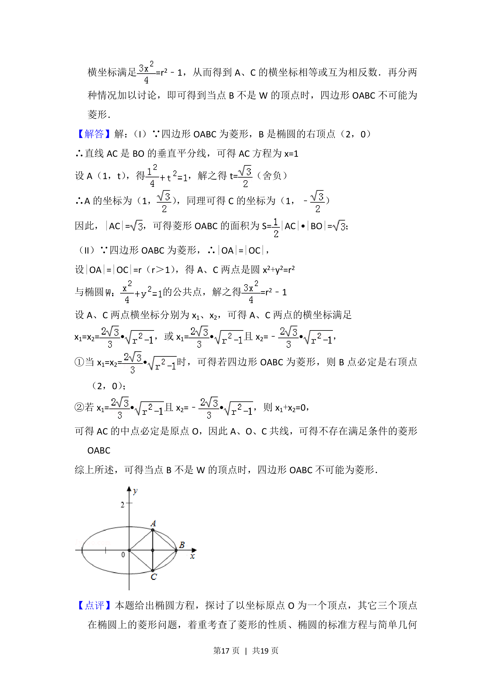
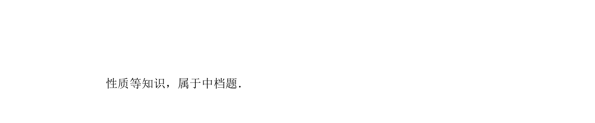

## 题面

## 摘要

椭圆上点构成菱形的面积计算与菱形存在性判断

## 关联考点

- [[944-椭圆的性质|椭圆的性质]]
- [[1100-菱形的性质|菱形的性质]]
- [[直线与椭圆方程]]

## 答案与解析

> 📄 原 PDF 第 16 页：`素材/真题/北京/2008-2024·（北京）数学高考真题/2013年高考数学试卷（理）（北京）（解析卷）.pdf`

<!-- 题干文本-start -->
## 题干文本
19． （14分）已知A，B，C是椭圆W： 上的三个点，O是坐标原点．
（Ⅰ）当点B是W的右顶点，且四边形OABC为菱形时，求此菱形的面积；
（Ⅱ）当点B不是W的顶点时，判断四边形OABC是否可能为菱形，并说明理
由．
<!-- 题干文本-end -->

<!-- 解析文本-start -->
## 解析文本
【考点】K4：椭圆的性质．菁优网版权所有
【专题】5D：圆锥曲线的定义、性质与方程．
【分析】 （I）根据B的坐标为（2，0）且AC是OB的垂直平分线，结合椭圆方
程算出A、C两点的坐标，从而得到线段AC的长等于 ．再结合OB的长为2
并利用菱形的面积公式，即可算出此时菱形OABC的面积；
（II）若四边形OABC为菱形，根据|OA|=|OC|与椭圆的方程联解，算出A、C的
<!-- 解析文本-end -->
