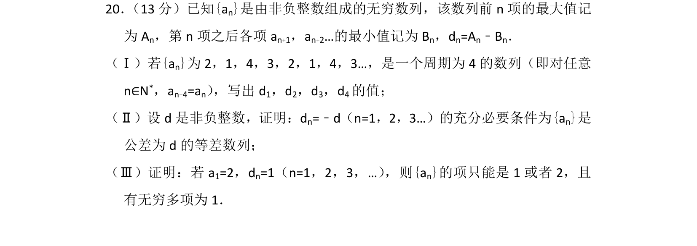
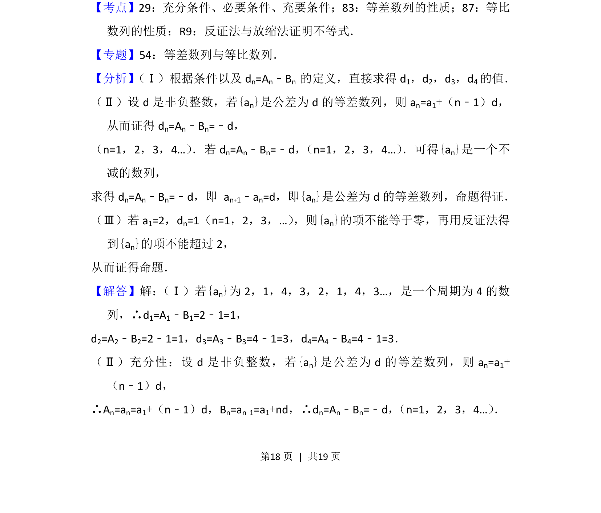
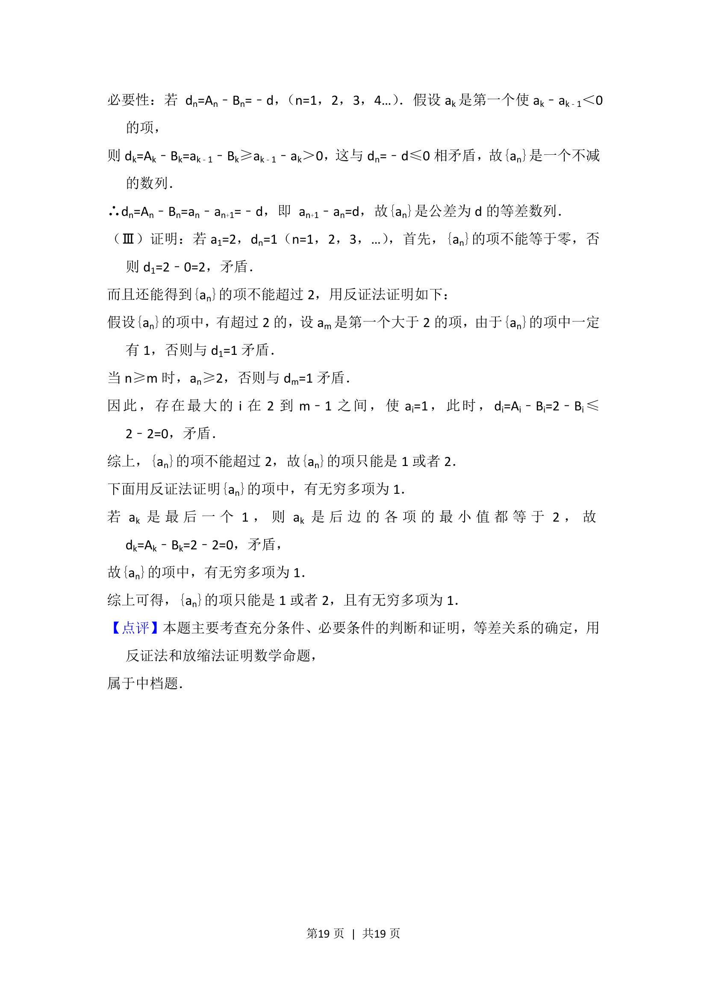

## 题面

## 摘要

本题通过数列的新定义（前n项最大值与之后项最小值之差）考查等差数列的充要条件证明及反证法探究数列项的性质。

## 关联考点

- [[数列新定义]]
- [[412-等差数列性质|等差数列性质]]
- [[533-充分必要条件|充分必要条件]]
- [[1180-反证法|反证法]]

## 答案与解析

> 📄 原 PDF 第 18 页：`素材/真题/北京/2008-2024·（北京）数学高考真题/2013年高考数学试卷（理）（北京）（解析卷）.pdf`
