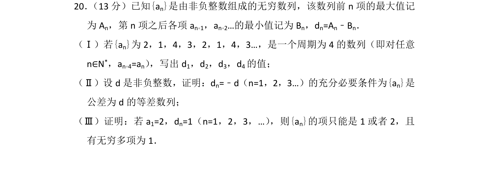
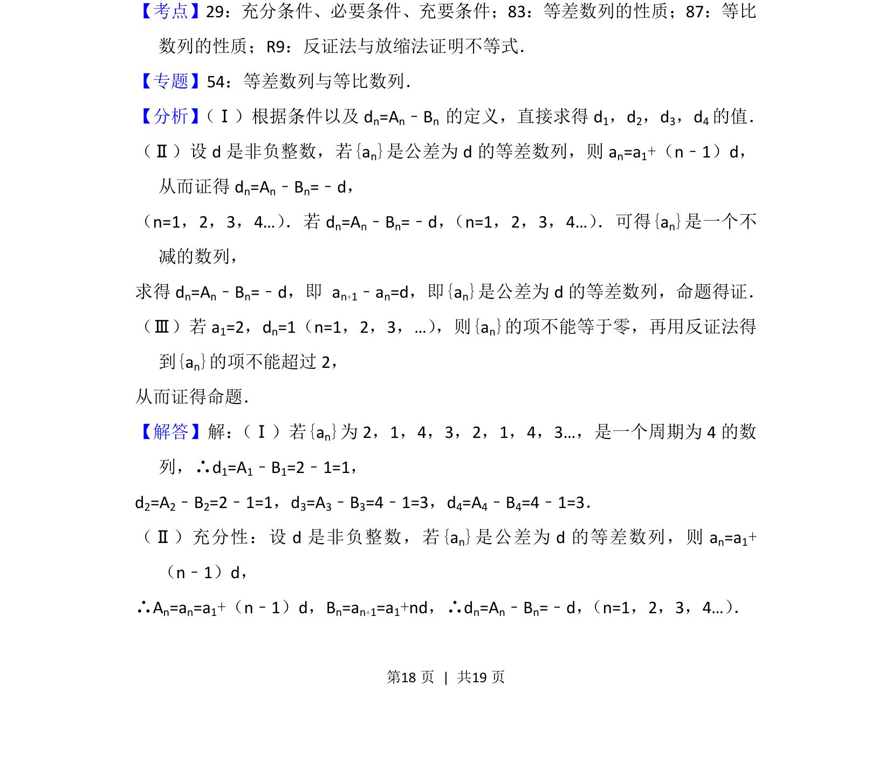
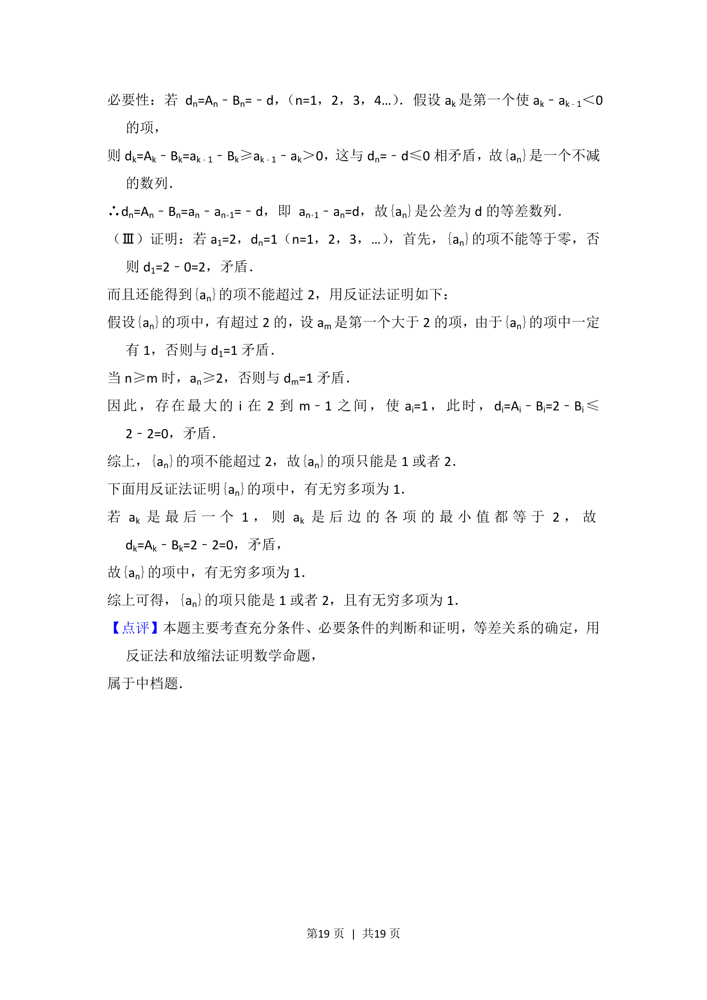

## 题面

## 摘要

本题通过数列的新定义（前n项最大值与之后项最小值之差）考查等差数列的充要条件证明及反证法探究数列项的性质。

## 关联考点

- [[1381-数列新定义|数列新定义]]
- [[412-等差数列性质|等差数列性质]]
- [[533-充分必要条件|充分必要条件]]
- [[1179-反证法|反证法]]

## 答案与解析

> 📄 原 PDF 第 18 页：`素材/真题/北京/2008-2024·（北京）数学高考真题/2013年高考数学试卷（理）（北京）（解析卷）.pdf`

<!-- 题干文本-start -->
## 题干文本
20． （13分）已知{an}是由非负整数组成的无穷数列，该数列前n项的最大值记
为A n，第n项之后各项a n+1，an+2…的最小值记为B n，dn=An﹣Bn．
（Ⅰ）若{an}为2，1，4，3，2，1，4，3…，是一个周期为4的数列（即对任意
n∈N*，an+4=an） ，写出d1，d2，d3，d4的值；
（Ⅱ）设d是非负整数，证明：d n=﹣d（n=1，2，3…）的充分必要条件为{an}是
公差为d的等差数列；
（Ⅲ）证明：若a 1=2，dn=1（n=1，2，3，…） ，则{an}的项只能是1或者2，且
有无穷多项为1．
<!-- 题干文本-end -->

<!-- 解析文本-start -->
## 解析文本
【考点】29：充分条件、必要条件、充要条件；83：等差数列的性质；87：等比
数列的性质；R9：反证法与放缩法证明不等式．菁优网版权所有
【专题】54：等差数列与等比数列．
【分析】 （Ⅰ）根据条件以及dn=An﹣Bn 的定义，直接求得d 1，d2，d3，d4的值．
（Ⅱ）设d是非负整数，若{a n}是公差为d的等差数列，则a n=a1+（n﹣1）d，
从而证得d n=An﹣Bn=﹣d，
（n=1，2，3，4…） ．若dn=An﹣Bn=﹣d， （n=1，2，3，4…） ．可得{an}是一个不
减的数列，
求得d n=An﹣Bn=﹣d，即 a n+1﹣an=d，即{an}是公差为d的等差数列，命题得证．
（Ⅲ）若a 1=2，dn=1（n=1，2，3，…） ，则{an}的项不能等于零，再用反证法得
到{an}的项不能超过2，
从而证得命题．
【解答】解： （Ⅰ）若{an}为2，1，4，3，2，1，4，3…，是一个周期为4的数
列，∴d1=A1﹣B1=2﹣1=1，
d2=A2﹣B2=2﹣1=1，d3=A3﹣B3=4﹣1=3，d4=A4﹣B4=4﹣1=3．
（Ⅱ）充分性：设d是非负整数，若{a n}是公差为d的等差数列，则a n=a1+
（n﹣1）d，
∴An=an=a1+（n﹣1）d，Bn=an+1=a1+nd，∴dn=An﹣Bn=﹣d， （n=1，2，3，4…） ．
<!-- 解析文本-end -->
