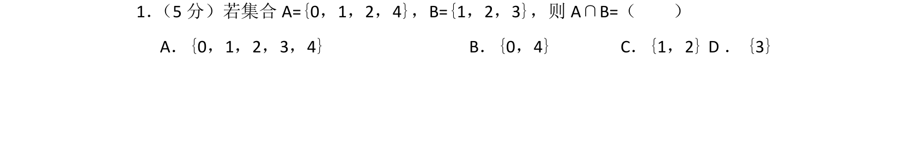
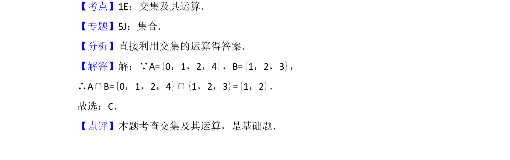

## 题面

## 摘要

本题考查集合的交集运算，属于基础概念题。

## 关联考点

- [[645-交集及其运算|交集及其运算]]
- [[042-集合|集合]]

## 答案与解析

> 📄 原 PDF 第 1 页：`素材/真题/北京/2008-2024·（北京）数学高考真题/2014年高考数学试卷（文）（北京）（解析卷）.pdf`

<!-- 题干文本-start -->
## 题干文本
1． （5分）若集合A={0，1，2，4}，B={1，2，3}，则A∩B=（　　）
A．{0，1，2，3，4}B．{0，4}C．{1，2}D．{3}
<!-- 题干文本-end -->

<!-- 解析文本-start -->
## 解析文本
【考点】1E：交集及其运算．菁优网版权所有
【专题】5J：集合．
【分析】直接利用交集的运算得答案．
【解答】解：∵A={0，1，2，4}，B={1，2，3}，
∴A∩B={0，1，2，4}∩{1，2，3}={1，2}．
故选：C．
【点评】本题考查交集及其运算，是基础题．
<!-- 解析文本-end -->
