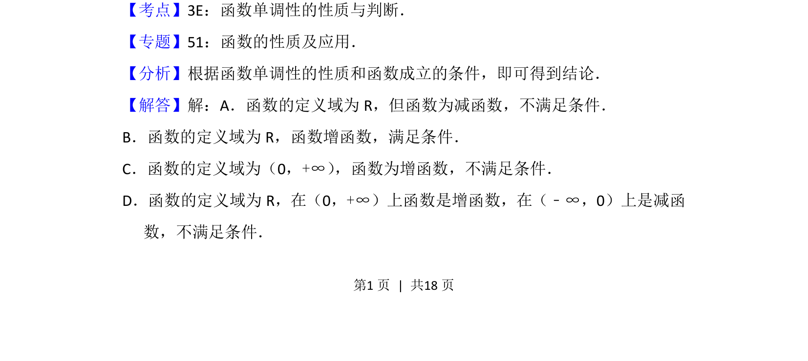

## 题面

## 摘要

给出下列函数，判断其定义域是否为R且在R上为增函数。

## 关联考点

- [[680-函数定义域|函数的定义域]]
- [[282-函数的单调性|函数的单调性]]

## 答案与解析

> 📄 原 PDF 第 1 页：`素材/真题/北京/2008-2024·（北京）数学高考真题/2014年高考数学试卷（文）（北京）（解析卷）.pdf`

<!-- 题干文本-start -->
## 题干文本
2． （5分）下列函数中，定义域是R且为增函数的是（　　）
A．y=e﹣x B．y=x C．y=lnx D．y=|x|
<!-- 题干文本-end -->

<!-- 解析文本-start -->
## 解析文本
【考点】3E：函数单调性的性质与判断．菁优网版权所有
【专题】51：函数的性质及应用．
【分析】根据函数单调性的性质和函数成立的条件，即可得到结论．
【解答】解：A．函数的定义域为R，但函数为减函数，不满足条件．
B．函数的定义域为R，函数增函数，满足条件．
C．函数的定义域为（0，+∞） ，函数为增函数，不满足条件．
D．函数的定义域为R，在（0，+∞）上函数是增函数，在（﹣∞，0）上是减函
数，不满足条件．
<!-- 解析文本-end -->
