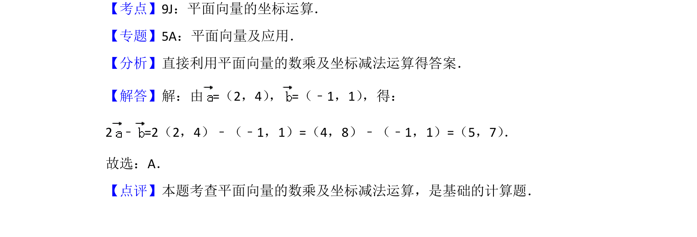

## 题面

## 摘要

向量的数乘与坐标减法运算，直接代入坐标计算即可得到结果。

## 关联考点

- [[335-平面向量坐标运算|平面向量的坐标运算]]
- [[327-向量的数乘|向量的数乘]]
- [[322-向量的减法|向量的减法]]

## 答案与解析

> 📄 原 PDF 第 2 页：`素材/真题/北京/2008-2024·（北京）数学高考真题/2014年高考数学试卷（文）（北京）（解析卷）.pdf`

<!-- 题干文本-start -->
## 题干文本
3． （5分）已知向量=（2，4） ，=（﹣1，1） ，则2﹣=（　　）
A． （5，7）B． （5，9）C． （3，7）D． （3，9）
<!-- 题干文本-end -->

<!-- 解析文本-start -->
## 解析文本
【考点】9J：平面向量的坐标运算．菁优网版权所有
【专题】5A：平面向量及应用．
【分析】直接利用平面向量的数乘及坐标减法运算得答案．
【解答】解：由=（2，4） ，=（﹣1，1） ，得：
2﹣=2（2，4）﹣（﹣1，1）=（4，8）﹣（﹣1，1）=（5，7） ．
故选：A．
【点评】本题考查平面向量的数乘及坐标减法运算，是基础的计算题．
<!-- 解析文本-end -->
