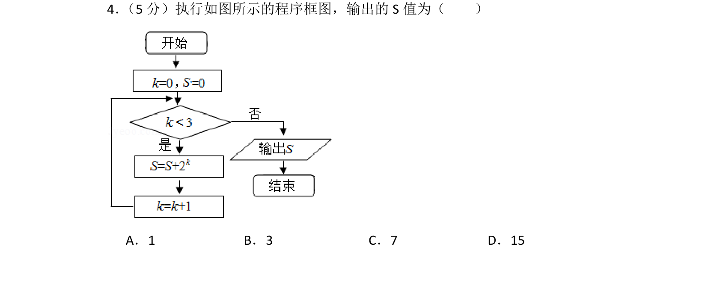
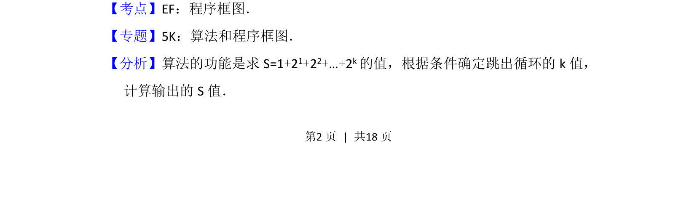
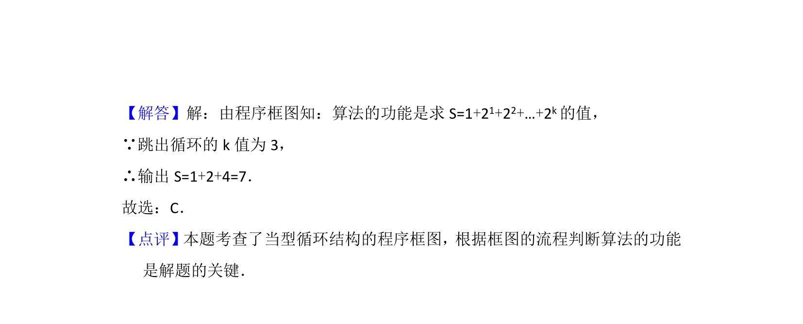

## 题面

## 摘要

该题通过程序框图实现等比数列求和，输出累加结果S的值。

## 关联考点

- [[1042-程序框图|程序框图]]
- [[357-等比数列前n项和|等比数列求和]]
- [[870-循环结构|循环结构]]

## 答案与解析

> 📄 原 PDF 第 2 页：`素材/真题/北京/2008-2024·（北京）数学高考真题/2014年高考数学试卷（文）（北京）（解析卷）.pdf`

<!-- 题干文本-start -->
## 题干文本
4． （5分）执行如图所示的程序框图，输出的S值为（　　）
A．1 B．3 C．7 D．15
<!-- 题干文本-end -->

<!-- 解析文本-start -->
## 解析文本
【考点】EF：程序框图．菁优网版权所有
【专题】5K：算法和程序框图．
【分析】算法的功能是求S=1+2 1+22+…+2k的值，根据条件确定跳出循环的k值，
计算输出的S值．
<!-- 解析文本-end -->
