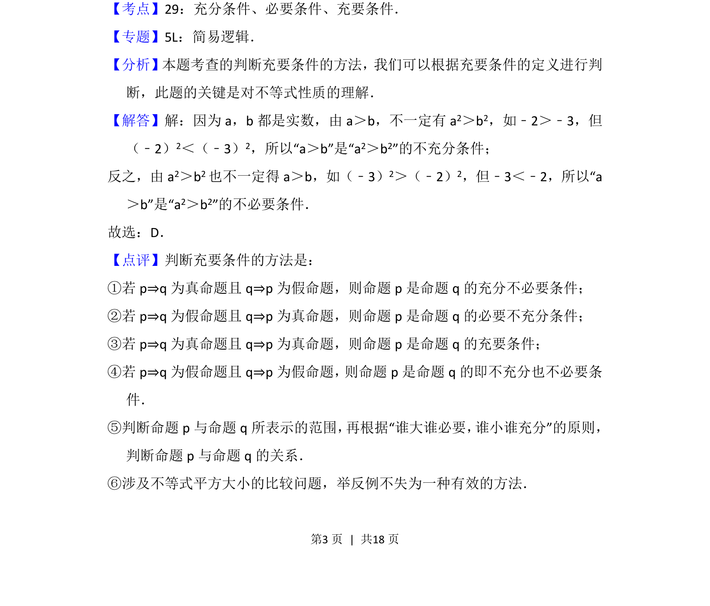

## 题面

## 摘要

本题考查充分条件与必要条件的判断，结合不等式性质通过反例说明推理关系。

## 关联考点

- [[278-充分条件必要条件|充分条件]]
- [[278-充分条件必要条件|必要条件]]
- [[117-不等式性质|不等式性质]]
- [[737-反例法|反例法]]

## 答案与解析

> 📄 原 PDF 第 3 页：`素材/真题/北京/2008-2024·（北京）数学高考真题/2014年高考数学试卷（文）（北京）（解析卷）.pdf`
