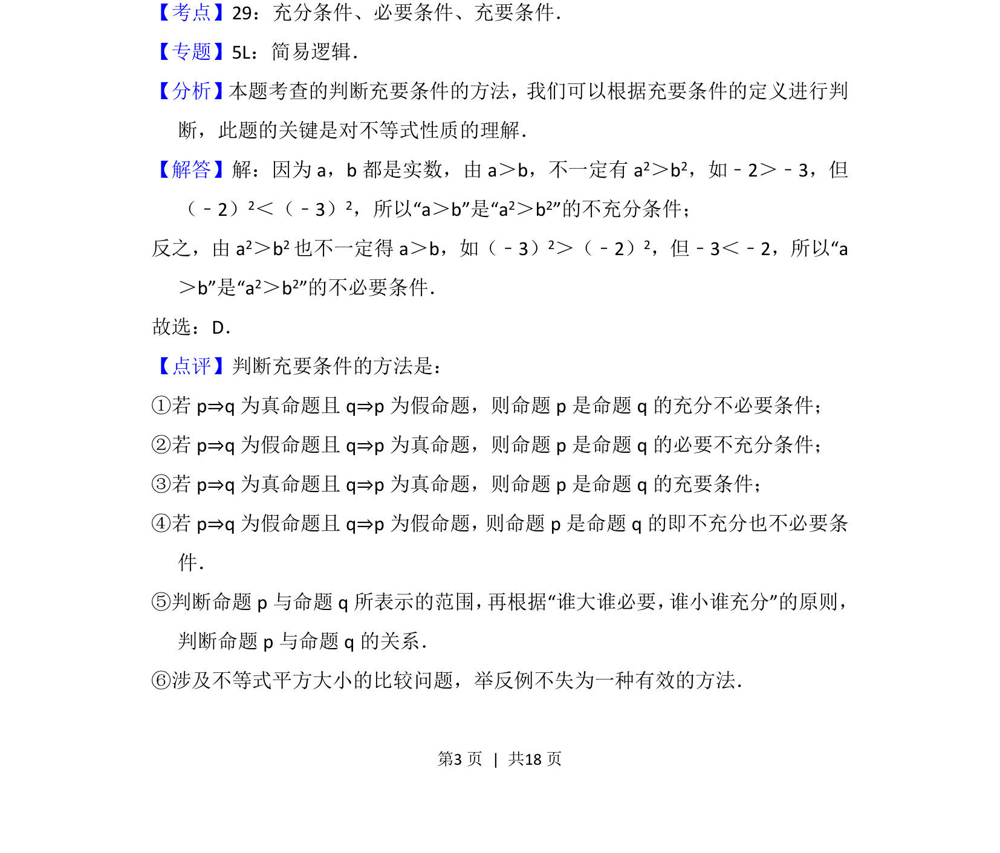

## 题面

## 摘要

本题考查充分条件与必要条件的判断，结合不等式性质通过反例说明推理关系。

## 关联考点

- [[278-充分条件必要条件|充分条件]]
- [[278-充分条件必要条件|必要条件]]
- [[117-不等式性质|不等式性质]]
- [[737-反例法|反例法]]

## 答案与解析

> 📄 原 PDF 第 3 页：`素材/真题/北京/2008-2024·（北京）数学高考真题/2014年高考数学试卷（文）（北京）（解析卷）.pdf`

<!-- 题干文本-start -->
## 题干文本
5． （5分）设a，b是实数，则“a＞b”是“a2＞b2”的（　　）
A．充分而不必要条件B．必要而不充分条件
C．充分必要条件D．既不充分也不必要条件
<!-- 题干文本-end -->

<!-- 解析文本-start -->
## 解析文本
【考点】29：充分条件、必要条件、充要条件．菁优网版权所有
【专题】5L：简易逻辑．
【分析】本题考查的判断充要条件的方法，我们可以根据充要条件的定义进行判
断，此题的关键是对不等式性质的理解．
【解答】解：因为a，b都是实数，由a＞b，不一定有a 2＞b2，如﹣2＞﹣3，但
（﹣2）2＜（﹣3）2，所以“a＞b”是“a2＞b2”的不充分条件；
反之，由a 2＞b2也不一定得a＞b，如（﹣3） 2＞（﹣2）2，但﹣3＜﹣2，所以“a
＞b”是“a2＞b2”的不必要条件．
故选：D．
【点评】判断充要条件的方法是：
①若p⇒q为真命题且q⇒p为假命题，则命题p是命题q的充分不必要条件；
②若p⇒q为假命题且q⇒p为真命题，则命题p是命题q的必要不充分条件；
③若p⇒q为真命题且q⇒p为真命题，则命题p是命题q的充要条件；
④若p⇒q为假命题且q⇒p为假命题， 则命题p是命题q的即不充分也不必要条
件．
⑤判断命题p与命题q所表示的范围， 再根据“谁大谁必要， 谁小谁充分”的原则，
判断命题p与命题q的关系．
⑥涉及不等式平方大小的比较问题，举反例不失为一种有效的方法．
<!-- 解析文本-end -->
