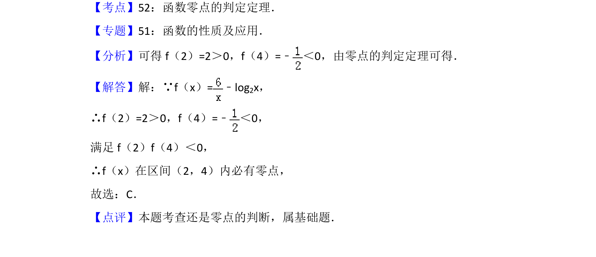

## 题面

## 摘要

本题考查函数零点存在性定理的应用，通过计算区间端点函数值判断零点所在区间。

## 关联考点

- [[函数零点判定定理]]
- [[695-函数零点的判定定理|零点存在性定理]]
- [[298-对数函数|对数函数]]

## 答案与解析

> 📄 原 PDF 第 4 页：`素材/真题/北京/2008-2024·（北京）数学高考真题/2014年高考数学试卷（文）（北京）（解析卷）.pdf`
