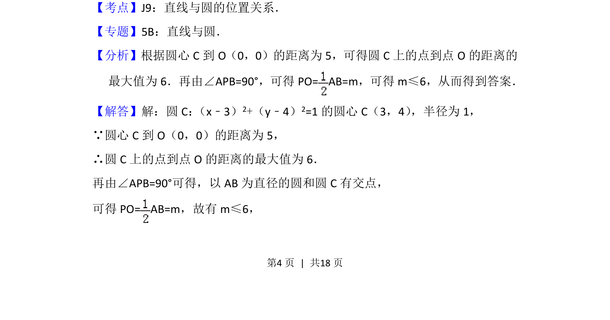
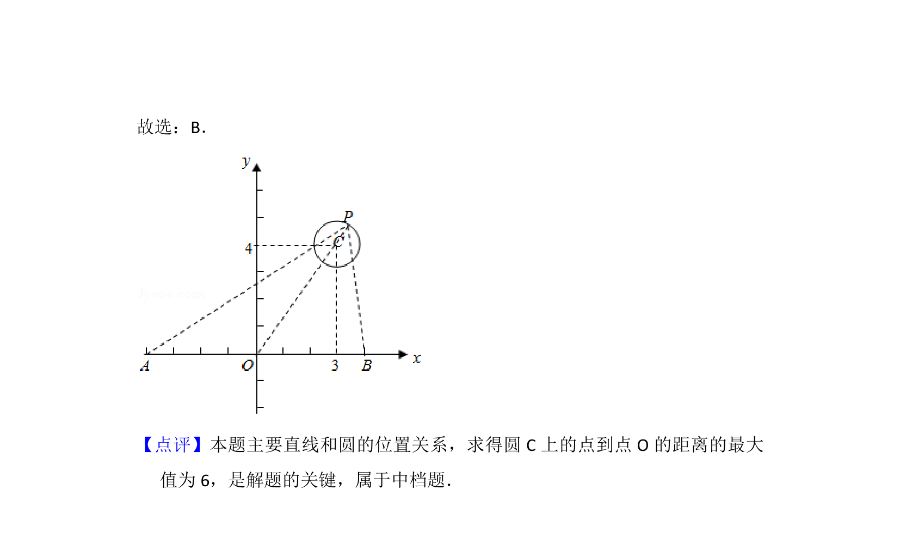

## 题面

## 摘要

已知定圆和两定点，圆上存在点使张角为直角，求参数最大值，转化为圆与圆的位置关系求解。

## 关联考点

- [[373-圆的标准方程|圆的标准方程]]
- [[点与圆的位置关系]]
- [[1284-圆与圆的位置关系|圆与圆的位置关系]]
- [[221-圆周角定理|圆周角定理]]

## 答案与解析

> 📄 原 PDF 第 4 页：`素材/真题/北京/2008-2024·（北京）数学高考真题/2014年高考数学试卷（文）（北京）（解析卷）.pdf`
