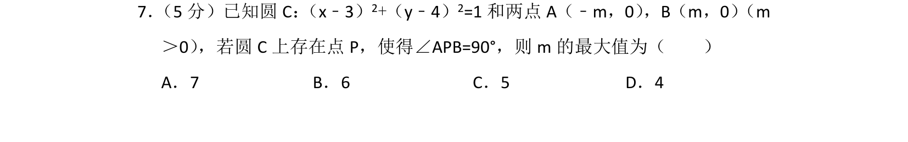
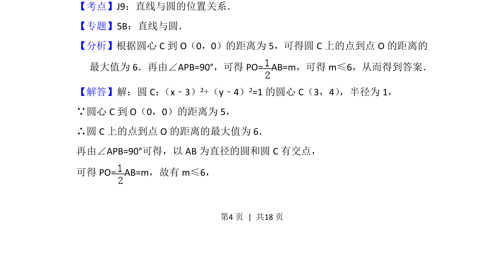
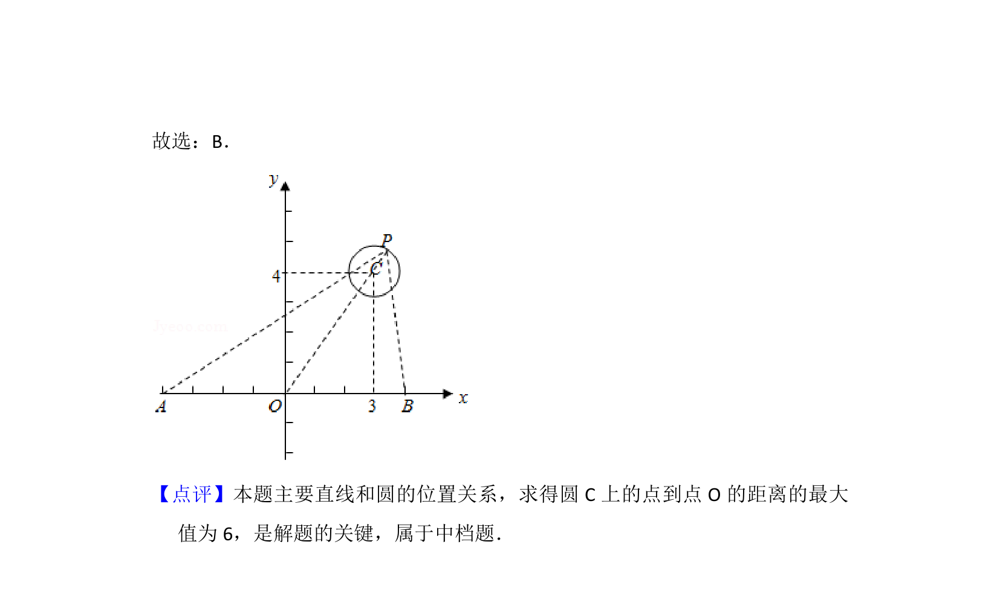

## 题面

## 摘要

已知定圆和两定点，圆上存在点使张角为直角，求参数最大值，转化为圆与圆的位置关系求解。

## 关联考点

- [[373-圆的标准方程|圆的标准方程]]
- [[230-点和圆的位置关系|点与圆的位置关系]]
- [[1283-圆与圆的位置关系|圆与圆的位置关系]]
- [[221-圆周角定理|圆周角定理]]

## 答案与解析

> 📄 原 PDF 第 4 页：`素材/真题/北京/2008-2024·（北京）数学高考真题/2014年高考数学试卷（文）（北京）（解析卷）.pdf`

<!-- 题干文本-start -->
## 题干文本
7． （5分）已知圆C： （x﹣3）2+（y﹣4）2=1和两点A（﹣m，0） ，B（m，0） （m
＞0） ，若圆C上存在点P，使得∠APB=90°，则m的最大值为（　　）
A．7 B．6 C．5 D．4
<!-- 题干文本-end -->

<!-- 解析文本-start -->
## 解析文本
【考点】J9：直线与圆的位置关系．菁优网版权所有
【专题】5B：直线与圆．
【分析】根据圆心C到O（0，0）的距离为5，可得圆C上的点到点O的距离的
最大值为6．再由∠APB=90°，可得PO= AB=m，可得m≤6，从而得到答案．
【解答】解：圆C： （x﹣3）2+（y﹣4）2=1的圆心C（3，4） ，半径为1，
∵圆心C到O（0，0）的距离为5，
∴圆C上的点到点O的距离的最大值为6．
再由∠APB=90°可得，以AB为直径的圆和圆C有交点，
可得PO= AB=m，故有m≤6，
<!-- 解析文本-end -->
