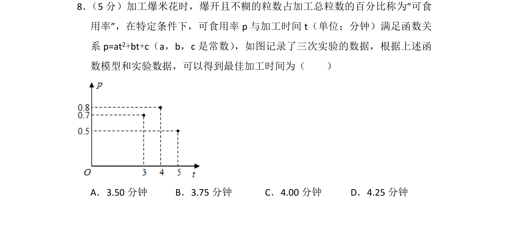
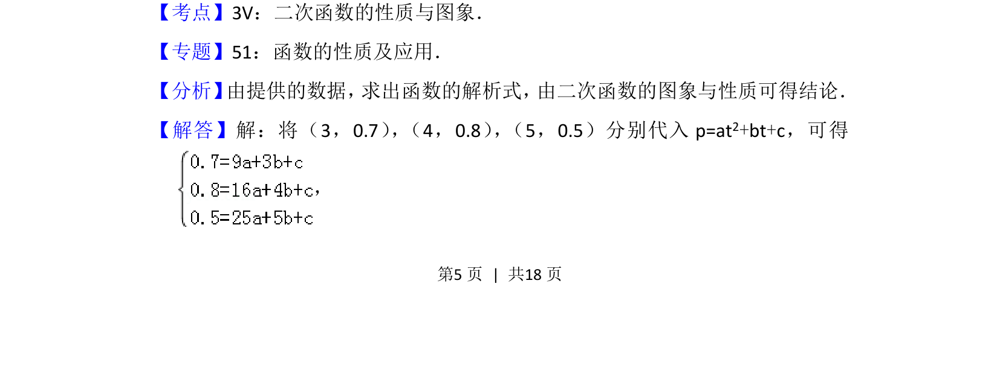
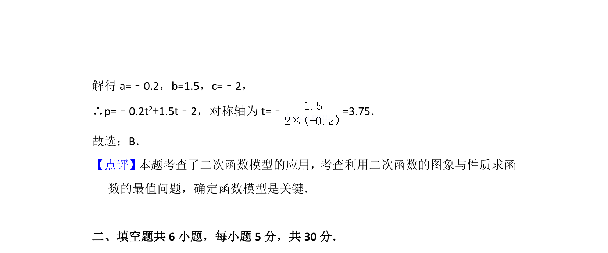

## 题面

## 摘要

该题通过实验数据拟合二次函数模型，求函数最大值点对应的加工时间，考查二次函数性质在实际问题中的应用。

## 关联考点

- [[二次函数的性质与图象]]
- [[数据拟合]]
- [[419-函数最值-高中|函数最值]]

## 答案与解析

> 📄 原 PDF 第 5 页：`素材/真题/北京/2008-2024·（北京）数学高考真题/2014年高考数学试卷（文）（北京）（解析卷）.pdf`
