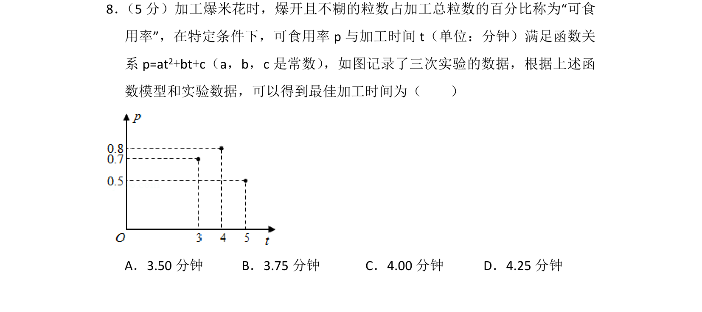
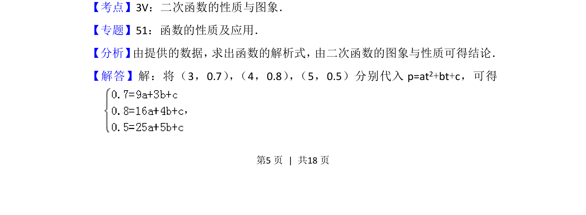
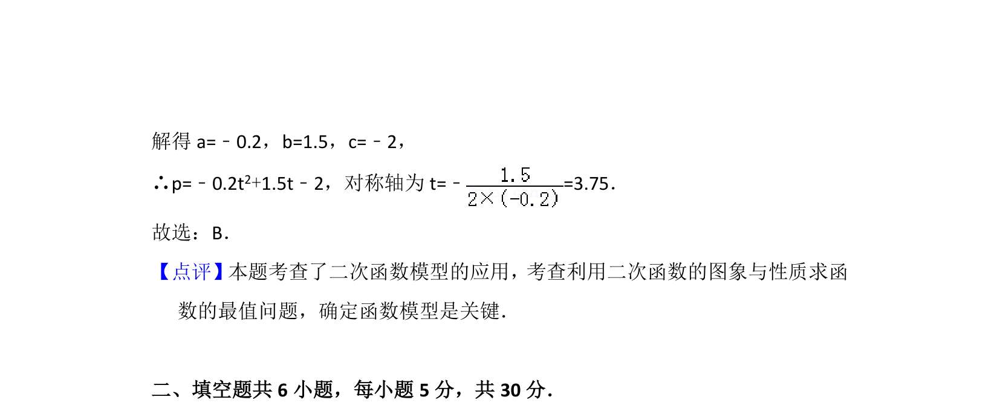

## 题面

## 摘要

该题通过实验数据拟合二次函数模型，求函数最大值点对应的加工时间，考查二次函数性质在实际问题中的应用。

## 关联考点

- [[1367-二次函数的性质与图象|二次函数的性质与图象]]
- [[数据拟合]]
- [[419-函数最值-高中|函数最值]]

## 答案与解析

> 📄 原 PDF 第 5 页：`素材/真题/北京/2008-2024·（北京）数学高考真题/2014年高考数学试卷（文）（北京）（解析卷）.pdf`

<!-- 题干文本-start -->
## 题干文本
8． （5分）加工爆米花时，爆开且不糊的粒数占加工总粒数的百分比称为“可食
用率”，在特定条件下，可食用率p与加工时间t（单位：分钟）满足函数关
系p=at 2+bt+c（a，b，c是常数） ，如图记录了三次实验的数据，根据上述函
数模型和实验数据，可以得到最佳加工时间为（　　）
A．3.50分钟B．3.75分钟C．4.00分钟D．4.25分钟
<!-- 题干文本-end -->

<!-- 解析文本-start -->
## 解析文本
【考点】3V：二次函数的性质与图象．菁优网版权所有
【专题】51：函数的性质及应用．
【分析】 由提供的数据， 求出函数的解析式， 由二次函数的图象与性质可得结论．
【解答】解：将（3，0.7） ， （4，0.8） ， （5，0.5）分别代入p=at2+bt+c，可得
，
<!-- 解析文本-end -->
