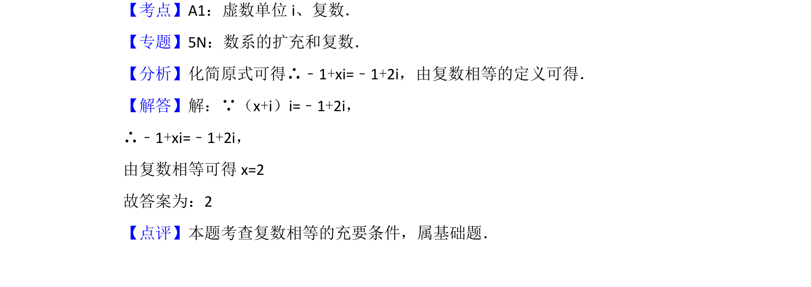

## 题面

## 摘要

该题考查复数乘法运算及复数相等的充要条件，通过化简方程求解未知实数。

## 关联考点

- [[1396-虚数单位i|虚数单位i]]
- [[332-复数的乘除运算|复数乘法]]
- [[809-复数相等|复数相等]]

## 答案与解析

> 📄 原 PDF 第 6 页：`素材/真题/北京/2008-2024·（北京）数学高考真题/2014年高考数学试卷（文）（北京）（解析卷）.pdf`
