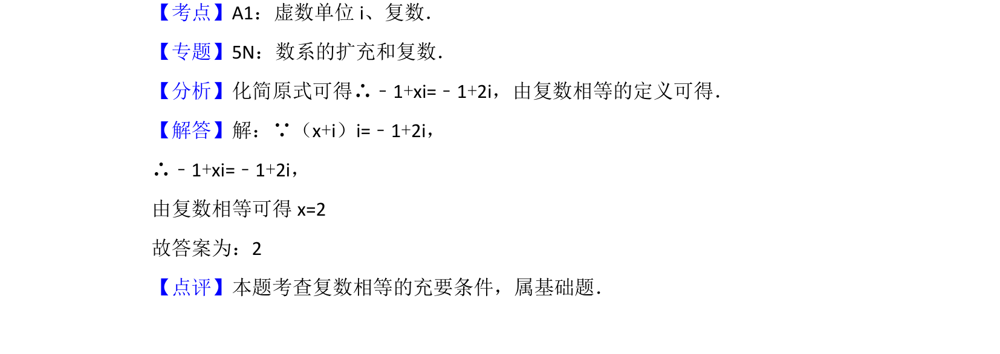

## 题面

## 摘要

该题考查复数乘法运算及复数相等的充要条件，通过化简方程求解未知实数。

## 关联考点

- [[1396-虚数单位i|虚数单位i]]
- [[332-复数的乘除运算|复数乘法]]
- [[809-复数相等|复数相等]]

## 答案与解析

> 📄 原 PDF 第 6 页：`素材/真题/北京/2008-2024·（北京）数学高考真题/2014年高考数学试卷（文）（北京）（解析卷）.pdf`

<!-- 题干文本-start -->
## 题干文本
9． （5分）若（x+i）i=﹣1+2i（x∈R） ，则x=　2　．
<!-- 题干文本-end -->

<!-- 解析文本-start -->
## 解析文本
【考点】A1：虚数单位i、复数．菁优网版权所有
【专题】5N：数系的扩充和复数．
【分析】化简原式可得∴﹣1+xi=﹣1+2i，由复数相等的定义可得．
【解答】解：∵（x+i）i=﹣1+2i，
∴﹣1+xi=﹣1+2i，
由复数相等可得x=2
故答案为：2
【点评】本题考查复数相等的充要条件，属基础题．
<!-- 解析文本-end -->
