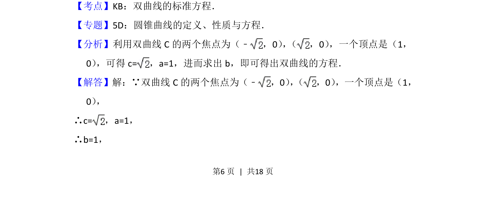
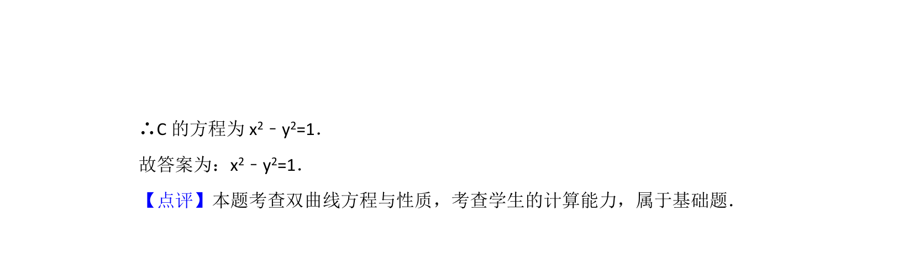

## 题面

## 摘要

根据给定双曲线的焦点和顶点求解标准方程。

## 关联考点

- [[368-双曲线定义与方程|双曲线]]
- [[928-标准方程|标准方程]]
- [[037-焦点焦距|焦点]]
- [[顶点]]

## 答案与解析

> 📄 原 PDF 第 6 页：`素材/真题/北京/2008-2024·（北京）数学高考真题/2014年高考数学试卷（文）（北京）（解析卷）.pdf`
