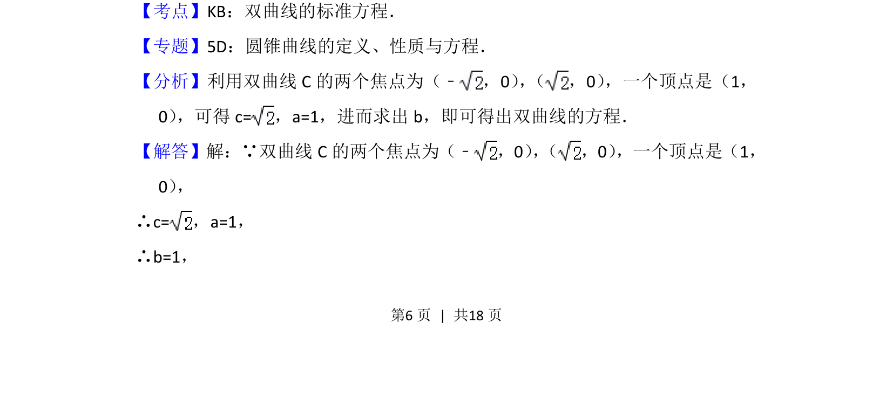
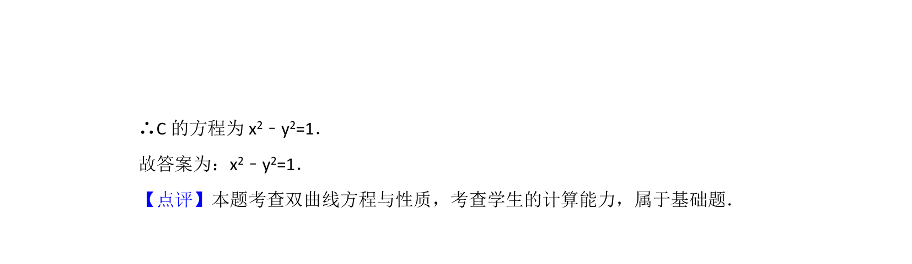

## 题面

## 摘要

根据给定双曲线的焦点和顶点求解标准方程。

## 关联考点

- [[368-双曲线定义与方程|双曲线]]
- [[928-标准方程|标准方程]]
- [[037-焦点焦距|焦点]]
- [[顶点]]

## 答案与解析

> 📄 原 PDF 第 6 页：`素材/真题/北京/2008-2024·（北京）数学高考真题/2014年高考数学试卷（文）（北京）（解析卷）.pdf`

<!-- 题干文本-start -->
## 题干文本
10． （5分）设双曲线C的两个焦点为（﹣，0） ， （ ，0） ，一个顶点是（1，
0） ，则C的方程为　x2﹣y2=1　．
<!-- 题干文本-end -->

<!-- 解析文本-start -->
## 解析文本
【考点】KB：双曲线的标准方程．菁优网版权所有
【专题】5D：圆锥曲线的定义、性质与方程．
【分析】利用双曲线C的两个焦点为（﹣，0） ， （ ，0） ，一个顶点是（1，
0） ，可得c=，a=1，进而求出b，即可得出双曲线的方程．
【解答】解：∵双曲线C的两个焦点为（﹣，0） ， （ ，0） ，一个顶点是（1，
0） ，
∴c=，a=1，
∴b=1，
<!-- 解析文本-end -->
