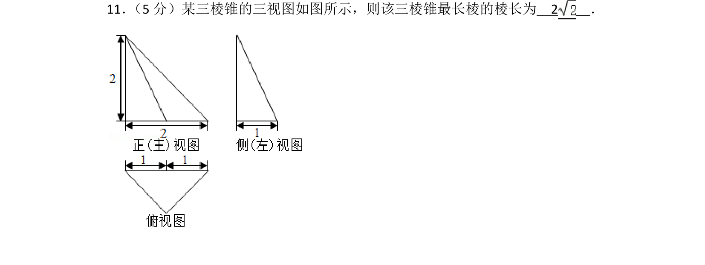
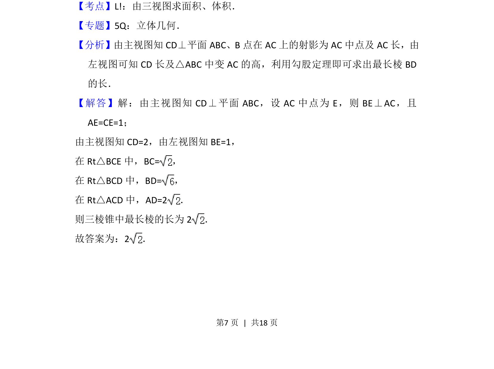
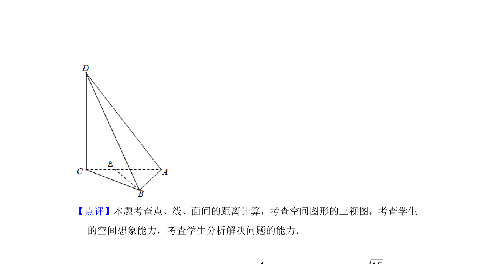

## 题面

## 摘要

由三视图还原三棱锥结构，借助勾股定理求最长棱长。

## 关联考点

- [[235-三视图|三视图]]
- [[1045-空间几何体|空间几何体]]
- [[189-勾股定理|勾股定理]]

## 答案与解析

> 📄 原 PDF 第 7 页：`素材/真题/北京/2008-2024·（北京）数学高考真题/2014年高考数学试卷（文）（北京）（解析卷）.pdf`
