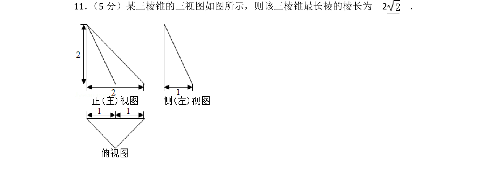
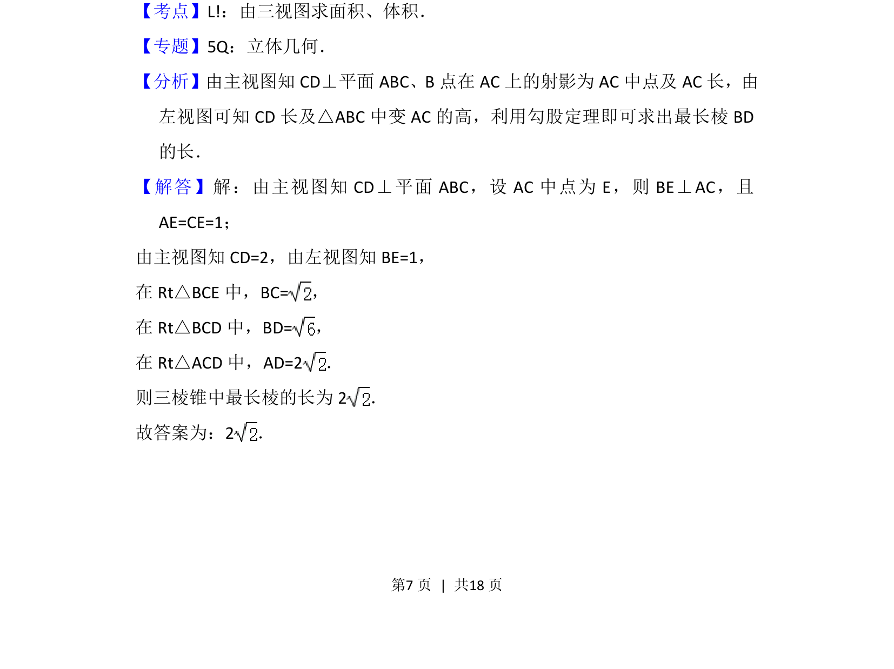
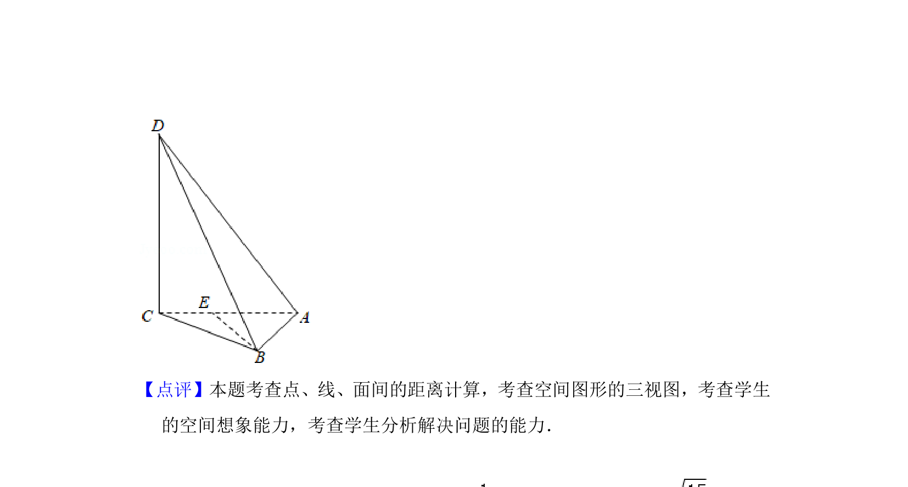

## 题面

## 摘要

由三视图还原三棱锥结构，借助勾股定理求最长棱长。

## 关联考点

- [[235-三视图|三视图]]
- [[1045-空间几何体|空间几何体]]
- [[189-勾股定理|勾股定理]]

## 答案与解析

> 📄 原 PDF 第 7 页：`素材/真题/北京/2008-2024·（北京）数学高考真题/2014年高考数学试卷（文）（北京）（解析卷）.pdf`

<!-- 题干文本-start -->
## 题干文本
11． （5分）某三棱锥的三视图如图所示，则该三棱锥最长棱的棱长为　2 　．
<!-- 题干文本-end -->

<!-- 解析文本-start -->
## 解析文本
【考点】L!：由三视图求面积、体积．菁优网版权所有
【专题】5Q：立体几何．
【分析】由主视图知CD⊥平面ABC、B点在AC上的射影为AC中点及AC长，由
左视图可知CD长及△ABC中变AC的高，利用勾股定理即可求出最长棱BD
的长．
【解答】解：由主视图知CD⊥平面ABC，设AC中点为E，则BE⊥AC，且
AE=CE=1；
由主视图知CD=2，由左视图知BE=1，
在Rt△BCE中，BC=，
在Rt△BCD中，BD=，
在Rt△ACD中，AD=2．
则三棱锥中最长棱的长为2．
故答案为：2．
<!-- 解析文本-end -->
