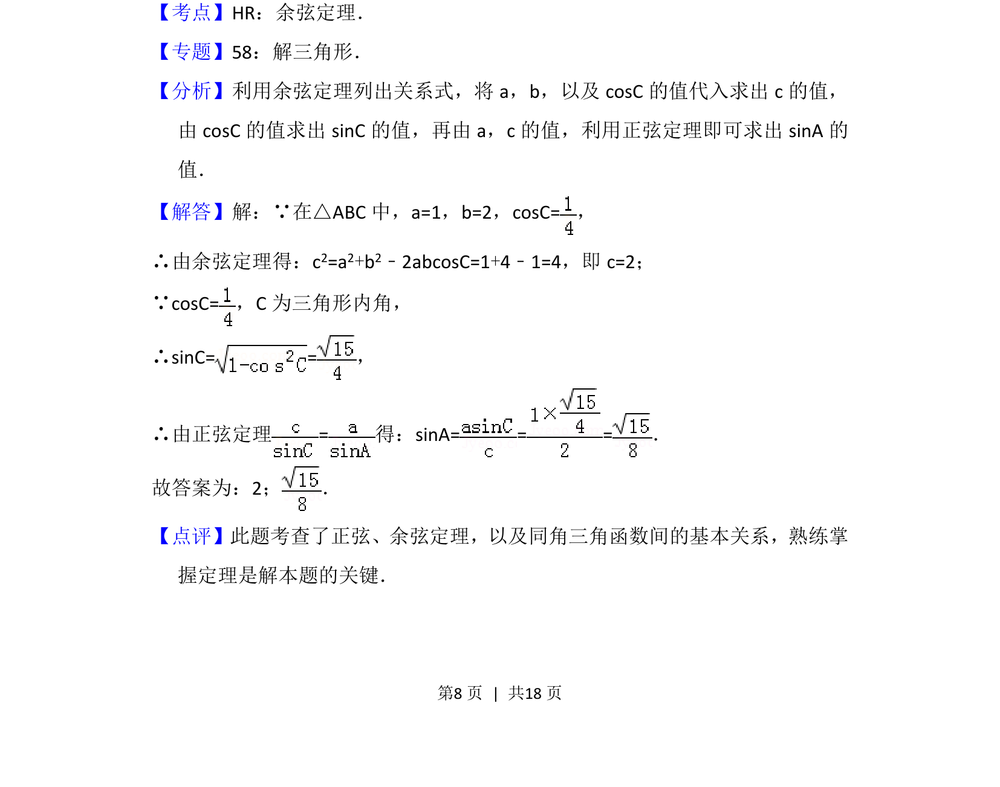

## 题面

## 摘要

在三角形中已知两边及夹角余弦，先利用余弦定理求第三边，再利用同角关系求夹角正弦，最后用正弦定理求角的正弦值。

## 关联考点

- [[126-定理|余弦定理]]
- [[126-定理|正弦定理]]
- [[741-同角三角函数基本关系|同角三角函数基本关系]]

## 答案与解析

> 📄 原 PDF 第 8 页：`素材/真题/北京/2008-2024·（北京）数学高考真题/2014年高考数学试卷（文）（北京）（解析卷）.pdf`
