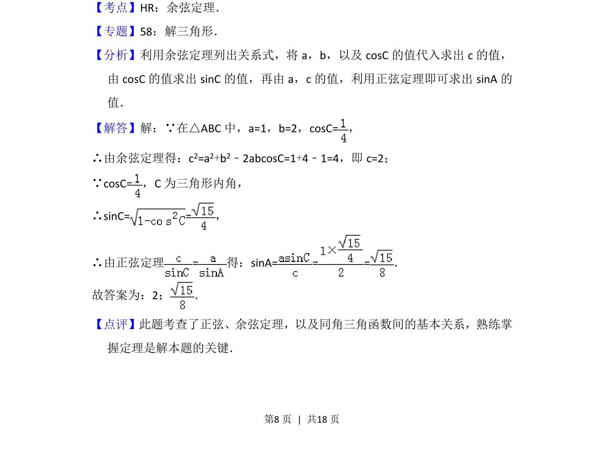

## 题面

## 摘要

在三角形中已知两边及夹角余弦，先利用余弦定理求第三边，再利用同角关系求夹角正弦，最后用正弦定理求角的正弦值。

## 关联考点

- [[126-定理|余弦定理]]
- [[126-定理|正弦定理]]
- [[741-同角三角函数基本关系|同角三角函数基本关系]]

## 答案与解析

> 📄 原 PDF 第 8 页：`素材/真题/北京/2008-2024·（北京）数学高考真题/2014年高考数学试卷（文）（北京）（解析卷）.pdf`

<!-- 题干文本-start -->
## 题干文本
12． （5分）在△ABC中，a=1，b=2，cosC=，则c=　2　；sinA=　 　．
<!-- 题干文本-end -->

<!-- 解析文本-start -->
## 解析文本
【考点】HR：余弦定理．菁优网版权所有
【专题】58：解三角形．
【分析】利用余弦定理列出关系式，将a，b，以及cosC的值代入求出c的值，
由cosC的值求出sinC的值，再由a，c的值，利用正弦定理即可求出sinA的
值．
【解答】解：∵在△ABC中，a=1，b=2，cosC=，
∴由余弦定理得：c2=a2+b2﹣2abcosC=1+4﹣1=4，即c=2；
∵cosC=，C为三角形内角，
∴sinC= =，
∴由正弦定理=得：sinA= = =．
故答案为：2； ．
【点评】此题考查了正弦、余弦定理，以及同角三角函数间的基本关系，熟练掌
握定理是解本题的关键．
<!-- 解析文本-end -->
