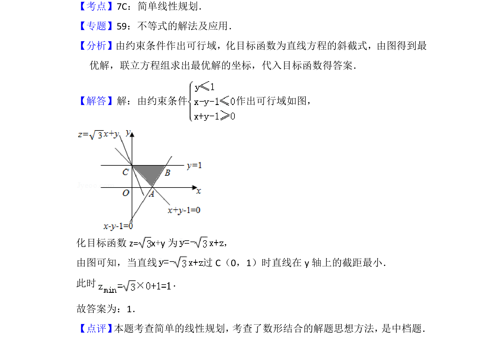

## 题面

## 摘要

该题考查利用线性规划求目标函数的最小值，通过约束条件作出可行域并求解最优解。

## 关联考点

- [[1074-简单线性规划|简单线性规划]]
- [[1156-可行域|可行域]]
- [[1000-目标函数最值|目标函数最值]]
- [[897-数形结合|数形结合]]

## 答案与解析

> 📄 原 PDF 第 9 页：`素材/真题/北京/2008-2024·（北京）数学高考真题/2014年高考数学试卷（文）（北京）（解析卷）.pdf`

<!-- 题干文本-start -->
## 题干文本
13． （5分）若x，y满足 ，则z= x+y的最小值为　1　．
<!-- 题干文本-end -->

<!-- 解析文本-start -->
## 解析文本
【考点】7C：简单线性规划．菁优网版权所有
【专题】59：不等式的解法及应用．
【分析】由约束条件作出可行域，化目标函数为直线方程的斜截式，由图得到最
优解，联立方程组求出最优解的坐标，代入目标函数得答案．
【解答】解：由约束条件 作出可行域如图，
化目标函数z= x+y为 ，
由图可知，当直线 过C（0，1）时直线在y轴上的截距最小．
此时 ．
故答案为：1．
【点评】 本题考查简单的线性规划， 考查了数形结合的解题思想方法， 是中档题．
<!-- 解析文本-end -->
