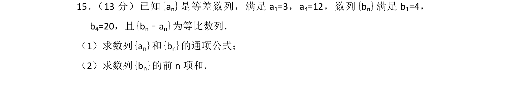
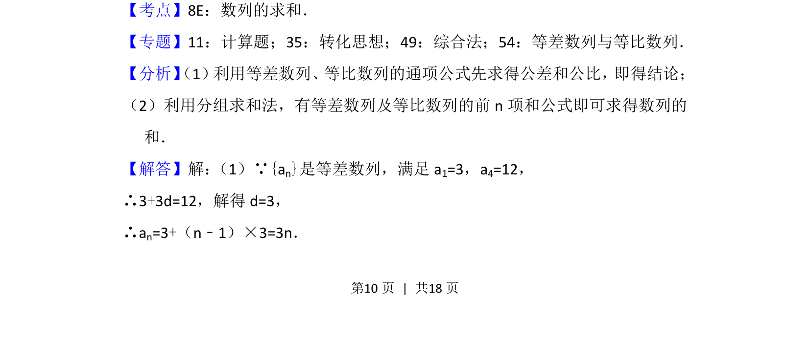
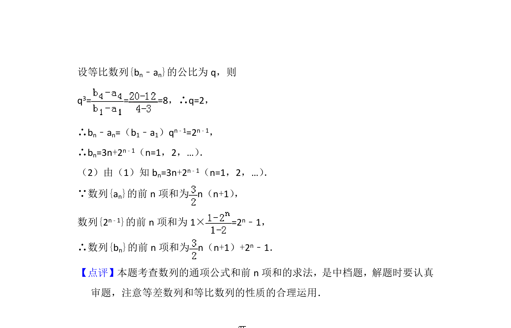

## 题面

## 摘要

已知等差数列和等比数列求通项及分组求和。

## 关联考点

- [[356-等差数列概念|等差数列]]
- [[1067-等比数列的定义与通项公式|等比数列]]
- [[384-数列通项公式|通项公式]]
- [[421-分组求和|分组求和]]

## 答案与解析

> 📄 原 PDF 第 10 页：`素材/真题/北京/2008-2024·（北京）数学高考真题/2014年高考数学试卷（文）（北京）（解析卷）.pdf`

<!-- 题干文本-start -->
## 题干文本
15． （13分）已知{an}是等差数列，满足a 1=3，a 4=12，数列{b n}满足b 1=4，
b4=20，且{bn﹣an}为等比数列．
（1）求数列{an}和{bn}的通项公式；
（2）求数列{bn}的前n项和．
<!-- 题干文本-end -->

<!-- 解析文本-start -->
## 解析文本
【考点】8E：数列的求和．菁优网版权所有
【专题】11：计算题；35：转化思想；49：综合法；54：等差数列与等比数列．
【分析】 （1）利用等差数列、等比数列的通项公式先求得公差和公比，即得结论；
（2）利用分组求和法，有等差数列及等比数列的前n项和公式即可求得数列的
和．
【解答】解： （1）∵{an}是等差数列，满足a 1=3，a4=12，
∴3+3d=12，解得d=3，
∴an=3+（n﹣1）×3=3n．
<!-- 解析文本-end -->
