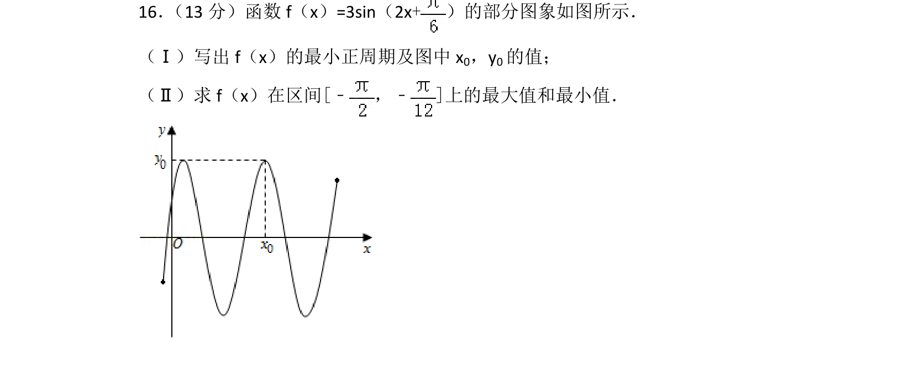
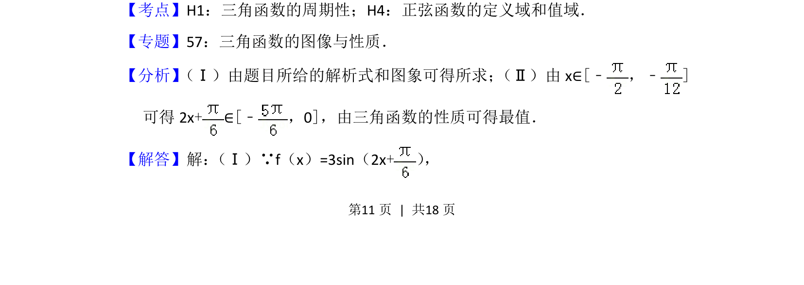
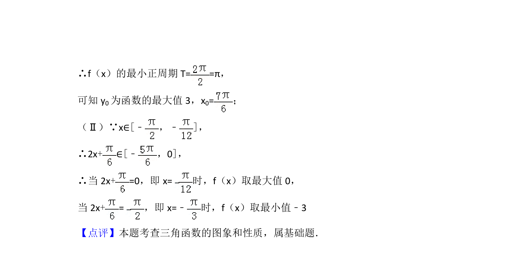

## 题面

## 摘要

考查正弦型函数的周期、图象点坐标及给定区间上的最值求解

## 关联考点

- [[611-三角函数的周期性|三角函数的周期性]]
- [[正弦函数的定义域和值域]]

## 答案与解析

> 📄 原 PDF 第 11 页：`素材/真题/北京/2008-2024·（北京）数学高考真题/2014年高考数学试卷（文）（北京）（解析卷）.pdf`

<!-- 题干文本-start -->
## 题干文本
16． （13分）函数f（x）=3sin（2x+）的部分图象如图所示．
（Ⅰ）写出f（x）的最小正周期及图中x 0，y0的值；
（Ⅱ）求f（x）在区间[﹣，﹣]上的最大值和最小值．
<!-- 题干文本-end -->

<!-- 解析文本-start -->
## 解析文本
【考点】H1：三角函数的周期性；H4：正弦函数的定义域和值域．菁优网版权所有
【专题】57：三角函数的图像与性质．
【分析】 （Ⅰ）由题目所给的解析式和图象可得所求； （Ⅱ）由x∈[﹣，﹣]
可得2x+∈[﹣，0]，由三角函数的性质可得最值．
【解答】解： （Ⅰ）∵f（x）=3sin（2x+） ，
<!-- 解析文本-end -->
