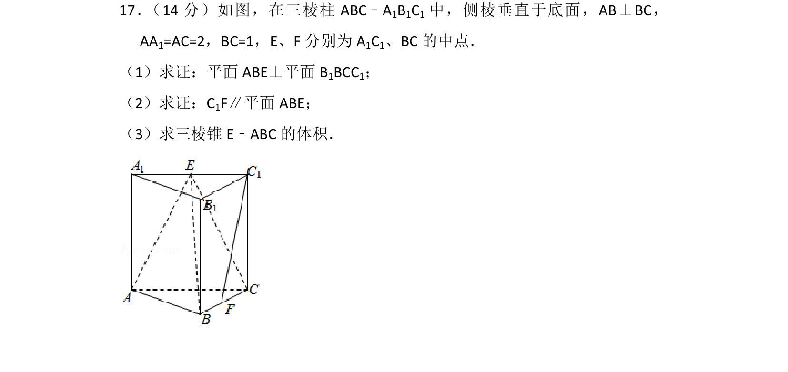
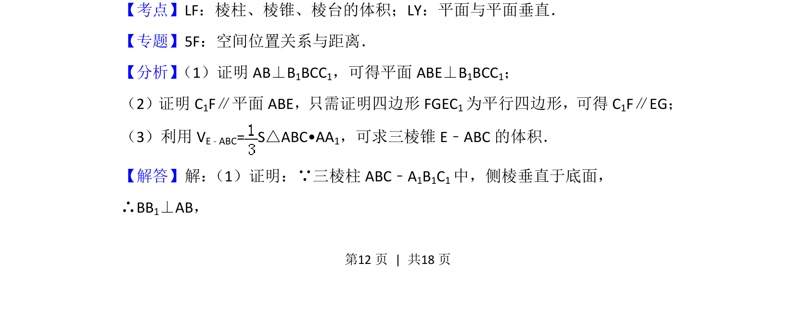
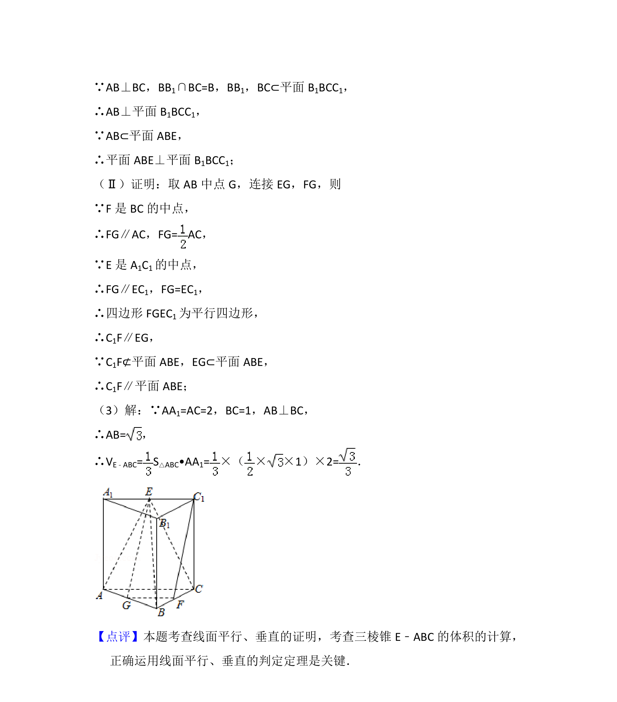

## 题面

## 摘要

三棱柱中证明面面垂直与线面平行，并求三棱锥体积

## 关联考点

- [[346-空间几何体-多面体|棱柱]]
- [[346-空间几何体-多面体|棱锥]]
- [[1387-棱台的体积|棱台的体积]]
- [[1397-平面与平面垂直|平面与平面垂直]]
- [[1011-直线与平面平行|直线与平面平行]]

## 答案与解析

> 📄 原 PDF 第 12 页：`素材/真题/北京/2008-2024·（北京）数学高考真题/2014年高考数学试卷（文）（北京）（解析卷）.pdf`
