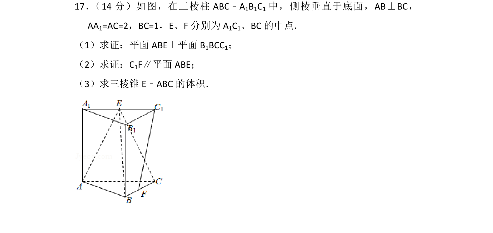
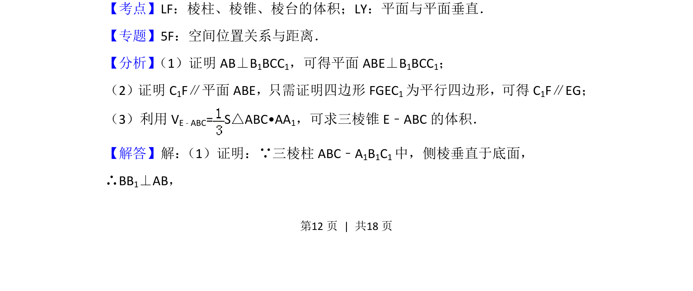
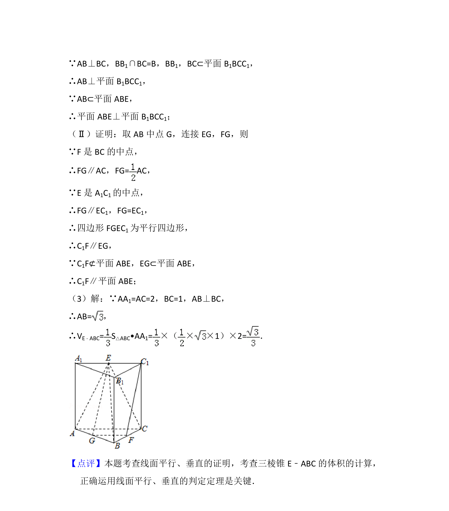

## 题面

## 摘要

三棱柱中证明面面垂直与线面平行，并求三棱锥体积

## 关联考点

- [[346-空间几何体-多面体|棱柱]]
- [[346-空间几何体-多面体|棱锥]]
- [[1387-棱台的体积|棱台的体积]]
- [[1397-平面与平面垂直|平面与平面垂直]]
- [[1011-直线与平面平行|直线与平面平行]]

## 答案与解析

> 📄 原 PDF 第 12 页：`素材/真题/北京/2008-2024·（北京）数学高考真题/2014年高考数学试卷（文）（北京）（解析卷）.pdf`

<!-- 题干文本-start -->
## 题干文本
17． （14分）如图，在三棱柱ABC﹣A 1B1C1中，侧棱垂直于底面，AB⊥BC，
AA1=AC=2，BC=1，E、F分别为A 1C1、BC的中点．
（1）求证：平面ABE⊥平面B 1BCC1；
（2）求证：C1F∥平面ABE；
（3）求三棱锥E﹣ABC的体积．
<!-- 题干文本-end -->

<!-- 解析文本-start -->
## 解析文本
【考点】LF：棱柱、棱锥、棱台的体积；LY：平面与平面垂直．菁优网版权所有
【专题】5F：空间位置关系与距离．
【分析】 （1）证明AB⊥B1BCC1，可得平面ABE⊥B 1BCC1；
（2）证明C 1F∥平面ABE，只需证明四边形FGEC 1为平行四边形，可得C 1F∥EG；
（3）利用V E﹣ABC= S△ABC•AA 1，可求三棱锥E﹣ABC的体积．
【解答】解： （1）证明：∵三棱柱ABC﹣A1B1C1中，侧棱垂直于底面，
∴BB1⊥AB，
<!-- 解析文本-end -->
